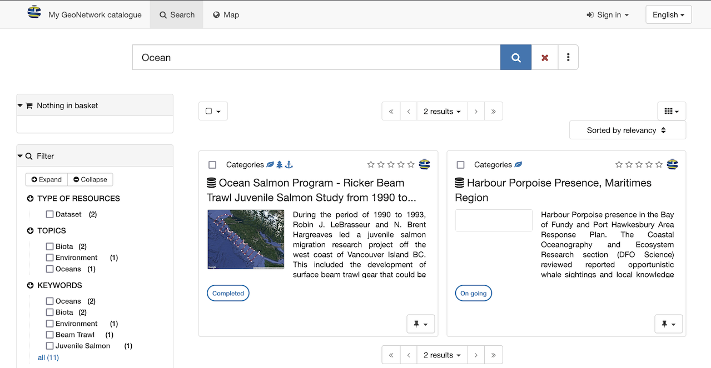
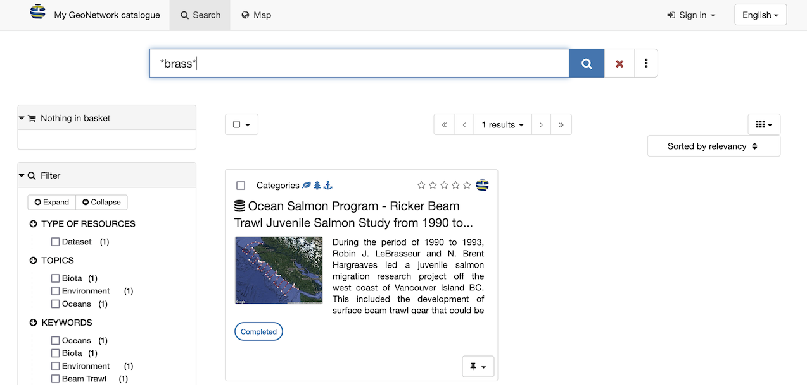

# Recherche de documents {#search-records}

Le catalogue GeoNetwork répertorie les jeux de données disponibles.

## Recherche dans le catalogue {#search-catalogue}

1.  Saisissez les mots-clés et les termes de recherche souhaités dans le champ de **recherche** situé en haut de la page et appuyez sur le bouton **:fontawesome-solid-magnifying-glass:** (ou utilisez la touche ++enter++) pour afficher les résultats de la recherche.

     *Champ de recherche*

2.  Recherche de mots complets.

    Utilisez le champ de **recherche** pour entrer : `Ocean`

     *Résultats de la recherche pour Océan*

3.  Effectuez une recherche en utilisant le caractère générique `*` pour trouver le début ou la fin d\'un mot. N\'oubliez pas que la recherche porte sur l\'ensemble du contenu de l\'enregistrement, et pas seulement sur les titres et la description.

    Utilisez le champ de **recherche** pour entrer : `Area*`

     *Recherche du début d\'un mot*

4.  Le caractère de remplacement `*` peut également être utilisé plusieurs fois pour correspondre à une partie d\'un mot.

    Utilisez le champ de **recherche** pour entrer : `*brass*`

     *Recherche d\'une partie de mot*

5.  Le filtrage et l\'exploration des [résultats de la recherche](#search-results) sont décrits ci-dessous.

## Parcourir le catalogue {#browse-catalogue}

1.  Naviguez vers **:geonetwork-logo : Mon catalogue Geonetwork** pour parcourir les enregistrements. Dans un système de production, le nom et le logo du catalogue correspondront à votre organisation ou à votre équipe de projet.

2.  La page du catalogue peut être explorée à l\'aide des listes rapides :

    -   **Dernières nouvelles**: fiches récemment mises à jour
    -   Les**plus populaires**: enregistrements fréquemment utilisés
    -   **Commentaires**: enregistrements avec de nouveaux commentaires et discussions

     *Dernières nouvelles*

3.  Les enregistrements sont affichés sous forme de :fontawesome-solid-table-cells-large: block list, :fontawesome-solid-bars: large list, ou :fontawesome-solid-align-justify: small list à l\'aide de la bascule à droite.

    Cliquez sur l\'un des enregistrements de la liste pour le consulter.

     *Affichage d\'une grande liste d\'enregistrements*

4.  La page du catalogue propose un certain nombre de recherches rapides pour parcourir le contenu du catalogue :

    -   Utilisez l\'option **Parcourir par thèmes** pour explorer les documents en fonction de leur sujet.
    -   Utilisez la **fonction Parcourir par ressources** pour explorer différents types de contenu.

    Chaque option énumère des \"facettes de recherche\" (représentées par de petites bulles). Cliquez sur une \"facette de recherche\" telle que `Dataset` pour explorer.

     *Parcourir le catalogue de métadonnées*

## Résultats de la recherche {#search-results}

Pour explorer davantage les enregistrements répertoriés :

1.  Naviguez jusqu\'à la page de recherche **:fontawesome-solid-magnifying-glass:** (ou parcourez le catalogue pour obtenir la liste des résultats de la **recherche** ).

     *Page de recherche*

2.  Utilisez la section **:fontawesome-solid-magnifying-glass: Filtre** sur le côté droit pour affiner les résultats de la recherche en utilisant des facettes de recherche supplémentaires, des mots-clés et des détails tels que le format de téléchargement.

    Cliquez sur la \"facette de recherche\" `Oceans` pour filtrer les résultats de la recherche sur les enregistrements correspondants.

     *Filtrer les résultats*

3.  Des options sont proposées en haut des résultats de la recherche pour :

    -   Présentation des enregistrements correspondants (sous forme de **:fontawesome-solid-table-cells-large: Grille** ou **:fontawesome-solid-bars: Liste**)
    -   Trier les résultats
    -   Gérer le nombre de résultats affichés par page
    -   Accéder à des pages supplémentaires de résultats
    -   Sélectionner rapidement des enregistrements

     *Parcourir les résultats*

4.  Pour effacer les résultats de la recherche, utilisez **:fontawesome-solid-xmark: Effacez** à tout moment **la requête, les filtres et les tris de la recherche en cours**. Ce bouton se trouve dans le champ de **recherche** en haut de la page.

5.  La **:fontawesome-solid-ellipsis-vertical:** Les options de recherche **avancée** se trouvent dans le champ **Recherche** en haut de la page.

    Ces options permettent d\'affiner les résultats de la recherche par catégorie, mots-clés, contact ou période.

     *Options de recherche avancée*

6.  Ouvrez le panneau d\'options de recherche avancée **:fontawesome-solid-ellipsis-vertical:** Panneau d\'options de recherche **avancée**.

    Utilisez le menu déroulant pour les **enregistrements créés au cours de la dernière année** pour sélectionner `this week`. Cela permet de remplir les champs de calendrier \" **De** \" et \" **A** \".

    Appuyez sur le bouton **:fontawesome-solid-magnifying-glass: pour** filtrer en utilisant cette plage de dates.

     *Enregistrement mis à jour au cours de la dernière semaine*

7.  Pour rechercher des données dans l\'année `2016` utilisez les options de recherche avancée pour remplir les **ressources créées au cours de la dernière** année :

    **De**
    :   `2016-01-01`

    **Pour**
    :   `2016-12-31`

    Appuyez sur le bouton **Recherche** pour afficher les données de `2016`.

     *Ressource mise à jour en 2016*

    ::: note
    Le filtre Date de la **ressource** affiche les enregistrements dont les dates d\'identification des données (création, publication, révision) sont comprises dans la plage de dates du calendrier.
    :::

8.  Une carte en diapositive est fournie au bas de la page, offrant un retour visuel sur l\'étendue de chaque enregistrement.

     *Carte de recherche*

    La carte peut être contrôlée en passant d\'un mode à l\'autre :

    -   Panoramique : Cliquez et faites glisser l\'emplacement de la carte, en utilisant la molette de la souris pour ajuster le niveau de zoom.

    -   Boîte de délimitation : Maintenez la touche ++shift++ enfoncée, puis cliquez et faites glisser pour définir un périmètre utilisé pour filtrer les enregistrements.

        Le menu déroulant permet de déterminer si l\'étendue est utilisée pour répertorier uniquement les enregistrements qui se trouvent à proximité ou tous les enregistrements qui se croisent.

         *Recherche des intersections de la boîte englobante*

9.  Les enregistrements sont sélectionnés (à l\'aide de la case à cocher située à côté de chacun d\'eux) pour télécharger ou générer rapidement un PDF d\'un ou de plusieurs enregistrements.

     *Dossiers sélectionnés*

10. Conseils et astuces supplémentaires concernant les résultats de recherche :

    -   Détails sur la [sélection de plusieurs enregistrements et l\'exportation](download.md#download-from-search-results) sous forme de fichier `ZIP` ou `PDF`.

