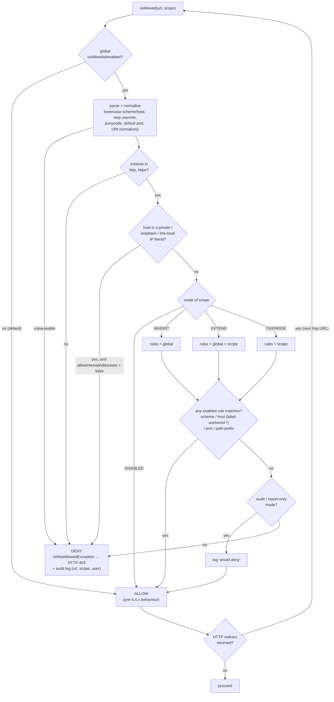

# Global URL allowlist — architecture and delivery plan

Status: **scenario C accepted** (global configuration, overridable per feature), to be delivered
incrementally — see §5. Scenarios A and B are kept in §4 as the evaluation record.
Target branch analysed: `main` @ `4.4.13-SNAPSHOT` (commit `9e562b54fd`)
Related: [PR #9377](https://github.com/geonetwork/core-geonetwork/pull/9377) (thesaurus URL allowlist), [GeoServer URL Checks](https://docs-archive.geoserver.org/stable/en/user/security/urlchecks.html)

---

## 1. Problem statement

Many GeoNetwork features accept a URL supplied by a user (editor, reviewer, admin) and either
**fetch it server-side** or **store it and serve it back** to end users. Today each feature does
its own thing — mostly nothing. PR #9377 added an allowlist, but only for thesaurus import.

Goal: one configurable, testable, documented mechanism that answers a single question —
*"is this application allowed to use this URL?"* — and to decide whether that configuration is
global, per feature, or global with per-feature overrides.

### 1.1 Two distinct risk classes (this drives the design)

| Class | What happens | Risk | Where a check belongs |
|---|---|---|---|
| **A — server-side fetch** | GeoNetwork opens the URL itself | **SSRF**: internal services, cloud metadata endpoints (`169.254.169.254`), `file:`/`jar:` scheme abuse, credential leak to third parties, DoS | At the moment of the HTTP call, plus at configuration save time for early feedback |
| **B — stored / rendered URL** | URL is persisted in a record and shown to end users or proxied on their behalf | Phishing, malvertising, mixed content, data exfiltration through the client, reputational damage | At save/validation time (and at proxy time for `/proxy?url=`) |

Class A is a security control and **must** be enforced server-side at the sink. Class B is mostly
an editorial/quality control and belongs to validation. A single API can serve both, but the
enforcement points and the failure behaviour differ, and this document keeps them separate.

### 1.2 Feature inventory (verified against the current source)

| Feature | Entry point | Class | Notes |
|---|---|---|---|
| Harvesters (CSW, OAI-PMH, GeoNetwork, WebDAV, simpleUrl, OGC WxS, THREDDS, geoPREST, …) | `harvesters/.../harvester/*`, `AbstractParams` | A | ~20 harvester types; no URL validation today in `AbstractParams` |
| DOI clients | `doi/.../client/{BaseDoiClient,DoiDataciteClient,DoiMedraClient}.java` | A | Admin-configured server URL |
| Map servers | `domain/.../MapServer.java`, `services/.../api/mapservers/MapServersApi.java` | A | Admin-configured (GeoServer publish target) |
| Editor — upload file from URL | `AttachmentsApi.putResourceFromURL` (line ~248) → `AbstractStore.putResource(ctx, uuid, URL, …)` (line ~282) | A | Direct SSRF sink, editor-reachable |
| Editor — online resource URLs | editor form / schema plugins | B | Stored, not fetched |
| Vocabularies / thesaurus import | `KeywordsApi` (`@RequestParam url`, line ~1158) | A | Covered by PR #9377 |
| XLink / directory entries | `jeeves/xlink/Processor.java` | A | `openStream()` on resolved xlink hrefs |
| Formatters, schema resolution, INSPIRE Atom, OAI-PMH server, translation providers, Spatineo, link checker | `XslUtil`, `SchemaUtils`, `InspireAtomUtil`, `LibreTranslateClient`, … | A | 52 files reference `GeonetHttpRequestFactory` |
| Client-side proxy | `web/.../proxy/URITemplateProxyServlet.java` | A+B | Already has partial protection (see below) |

### 1.3 What already exists (do not reinvent)

* **`URITemplateProxyServlet`** — the only existing URL gate. It has an `excludeHosts` regex
  (a *denylist*), an `allowPorts` set defaulting to `{80, 443}`, and a `securityMode` of
  `NONE | DB_LINK_CHECK` (restrict proxying to hosts already present in analysed metadata links).
  Configured through `web.xml` init-params + `config.properties` (`${proxy.excludeHosts}`,
  `${proxy.securityMode}`) — i.e. **file-based, not DB settings, not UI-editable**.
* **`GeonetHttpRequestFactory`** (`common/.../utils/GeonetHttpRequestFactory.java`) — the closest
  thing to a central HTTP choke point: `execute(HttpUriRequest, …)` overloads and
  `createXmlRequest(URL)`. Referenced by 52 Java files.
* **Bypasses of that choke point**: ~19 raw `openStream()` / `openConnection()` call sites across
  14 non-test files (`Xml.java`, `XslUtil`, `Processor`, `AbstractStore`, `NetLib`,
  `EsHTTPProxy`, `thredds/Harvester`, `ImageReplacedElementFactory`, jclouds stores, …), plus
  `Xml.loadFile(URL)`. **Any design that claims "one choke point" must close these first.**
* **`org.fao.geonet.kernel.url.UrlChecker`** — *already taken*: this is the broken-link checker
  (`UrlAnalyzer`/`LinkStatus`). Naming collision: do **not** call the new service `UrlChecker`.
* **PR #9377** — `SYSTEM_METADATA_THESAURUS_URL_ALLOWLIST` setting + `UrlAllowlistService`
  interface, host-anchored `*` wildcard patterns, `v4412` migration, admin UI field.
  Not present in the analysed checkout of `main`; treat it as the 4.4.x precedent and the thing to
  generalise (and migrate away from).
* **Settings infrastructure** — `Settings` constants, `SettingManager.getValue*`,
  `SettingDataType`, seed rows in `setup/sql/data/data-db-default.sql`, upgrades in
  `setup/sql/migrate/v44xx/migrate-default.sql`, admin UI driven by
  `web-ui/.../admin/system.html` + `en-admin.json`. Settings are cached in `SettingManager`.

---

## 2. GeoServer URL Checks — what to borrow, what to leave

GeoServer's model:

* one **global enable flag**; when off, no checks at all;
* a flat **list of named rules**, each `{name, description, regex, enabled}`;
* **enabled + empty list = deny everything** user-supplied;
* applies **only to user-supplied URLs** (remote SLD, remote icons, `REMOTE_OWS`, WPS remote
  inputs); **administrator-configured URLs bypass the checks** (WFS stores, cascaded WMS/WMTS);
* an admin page with add/remove/edit **and a "test this URL" form**;
* URLs are **normalised before matching** (redundant `.`/`..` removed, `file:` canonicalised to
  `file:///`) so patterns are portable.

### Worth adopting

1. **Global on/off flag, default off** — mandatory for upgrade compatibility.
2. **"Enabled + empty list = deny"** — a fail-closed rule that is easy to document, and it makes
   "enable the feature" a deliberate, complete act rather than a silent half-measure.
3. **Normalise before matching.** This is the single most common bypass class. GeoNetwork must go
   further than GeoServer: lowercase scheme/host, strip `userinfo`, apply IDN/punycode
   normalisation, resolve default ports, decode percent-encoding once, normalise the path.
4. **The URL test form in the admin UI.** Cheap, and it is the difference between a feature admins
   configure correctly and a feature they disable in frustration.
5. **The user-supplied vs admin-configured distinction** — but GeoNetwork should make it
   *configurable* rather than hard-coded, because in GeoNetwork the "administrator" who configures
   a harvester is often not the platform operator (multi-tenant catalogues, delegated
   `UserAdmin`/`Reviewer` roles).

### Worth rejecting / changing

1. **Raw regex as the only pattern language.** Regex over full URLs is a footgun: an unanchored
   `.*example\.org.*` happily matches `https://evil.org/?x=example.org`. PR #9377 already chose
   the safer route (host-anchored wildcards). Recommendation: **structured matching** —
   `scheme://host[:port]/path-prefix` with `*` wildcards, matched against the *parsed* URI
   component by component, with regex available as an explicit escape hatch flagged as advanced.
2. **Flat list with no grouping.** GeoNetwork needs per-feature scoping (see §4), so rules need a
   scope attribute from day one even if scenario A ships first.
3. **Check only at the "user-supplied" layer.** GeoServer can do that because its remote-fetch
   paths are few. GeoNetwork's are many and scattered; the check has to sit at the HTTP client,
   not only at the API boundary.

---

## 3. Common core (identical in all three scenarios)

Everything below is scenario-independent. The scenarios differ **only** in how a rule set is
selected and resolved (§4).

### 3.1 API

New package `org.fao.geonet.kernel.security.url` in `core` (visible to `services`, `harvesters`,
`doi`, `web`; `common` if the check must live inside `GeonetHttpRequestFactory` — see §3.3):

```java
enum UrlScope { GLOBAL, HARVESTER, DOI, MAPSERVER, THESAURUS, EDITOR_UPLOAD,
                ONLINE_RESOURCE, XLINK, PROXY, FORMATTER, ... }

interface UrlAllowlistService {
    boolean isAllowed(String url, UrlScope scope);
    void assertAllowed(String url, UrlScope scope) throws UrlNotAllowedException;  // sink-side
    List<UrlRule> getRules(UrlScope scope);                                        // admin UI
    UrlCheckResult test(String url, UrlScope scope);                               // admin "test" form
}
```

* Keep the PR #9377 interface name `UrlAllowlistService` — it is already the 4.4.x API and reuse
  avoids a second rename. Add the `UrlScope` argument (see migration, §7).
* `UrlScope` is a **fixed enum, evaluated catalogue-wide** — configuration is not per group or per
  portal (decision 1, §8.2). This keeps `isAllowed` free of any security-context lookup, so it can
  be called from `common`, from schematron and from background threads (harvesters, scheduled
  tasks) where no user session exists.
* `UrlNotAllowedException` maps to **HTTP 403** through the existing
  `ApiExceptionHandler`/`GlobalExceptionHandler` machinery, with a message naming the URL and the
  scope so admins can fix the configuration without reading logs.
* Bean registered in `core/src/main/resources/config-spring-geonetwork.xml`, same as PR #9377.

### 3.2 Matching and normalisation (the part that actually has to be right)

Order of operations in `isAllowed`:

1. Parse with `java.net.URI` (not `URL` — `URL.equals` does DNS lookups). Reject unparseable.
2. **Scheme allowlist**, separate and always on when checks are enabled: `http`, `https` only by
   default; `file`, `jar`, `ftp`, `gopher`, `netdoc`, `mailto` denied unless explicitly configured.
3. Normalise: lowercase scheme and host, strip `userinfo` (`https://allowed.org@evil.org/`),
   punycode the host, drop the default port, `URI.normalize()` the path, reject control/whitespace
   characters.
4. **Literal-IP policy**: when the host is an IP literal in a private/link-local/loopback range
   (RFC1918, `127/8`, `169.254/16`, `::1`, `fc00::/7`, IPv4-mapped IPv6), **deny — even if a rule
   matches** (decision 3, §8.2). This gate sits *above* rule matching, so a broad or careless rule
   cannot open a path to `169.254.169.254` or to a service on localhost; it is what stops
   cloud-metadata SSRF, which host-name allowlists alone do not.
   The single escape hatch is `system/urlAllowlist/allowInternalAddresses` (boolean, default
   `false`), for intranet deployments that legitimately harvest internal hosts. When it is on, IP
   literals fall through to normal rule matching and nothing else changes. It is deliberately one
   global switch rather than a per-rule flag: an operator who needs internal addresses knows it at
   deployment time, and a per-rule flag would be set by copy-paste.
5. Match against rules component-wise: scheme, host (wildcard anchored at label boundaries —
   `*.example.org` matches `a.example.org`, **not** `evil-example.org`), port, path prefix.
6. Fail-closed default when checks are enabled and no rule matches.

Two hard problems to decide explicitly, not by accident:

* **Redirects.** An allowed host can 302 to a denied one. Enforce by installing a
  `RedirectStrategy` on the shared `HttpClientBuilder` that re-checks each hop. Without this the
  whole control is decorative. *This alone justifies putting the check in
  `GeonetHttpRequestFactory` rather than only in API controllers.*
* **DNS rebinding / TOCTOU.** Name resolves to an allowed IP at check time, to `127.0.0.1` at
  connect time. Full mitigation needs a custom `DnsResolver`/connection-socket-factory that
  validates the resolved address. Recommend: ship the name-based check first, add IP validation at
  connect time as a later hardening work package, and say so in the docs rather than implying a
  guarantee that is not there.

### 3.3 Enforcement points

| Layer | What it catches | Cost |
|---|---|---|
| **`GeonetHttpRequestFactory.execute(...)` / `createXmlRequest(URL)`** | ~52 files' worth of class-A fetches, redirects included | Low — one file, but `common` must see the service (inject an interface + a no-op default so `common` keeps building standalone) |
| **The ~19 raw `openStream()`/`openConnection()` sites + `Xml.loadFile(URL)`** | the bypasses | Medium — each must be converted to the factory or given an explicit check |
| **API controllers** (`AttachmentsApi`, `KeywordsApi`, `MapServersApi`, harvester config save) | early, user-friendly 403 with a clear message; class B | Low per site |
| **Editor validation / `URITemplateProxyServlet`** | class B online resources | Medium — schema-plugin dependent |

Recommended: choke point first (highest coverage per unit of work), controllers second (UX),
bypass sites third, editor/proxy last.

### 3.4 Configuration storage

Rules are a **list of structured objects**, so a scalar `Settings` row is a poor fit once there is
more than one rule.

* **Option 1 — JSON in a `Settings` row.** Reuses `SettingManager`, its cache and the existing
  admin settings plumbing; no schema change; trivially exportable. Weak validation, awkward UI,
  and it is how PR #9377 already stores its single-scope list.
* **Option 2 — a `UrlAllowlistRule` JPA entity + table + repository + REST API.** Proper
  validation, per-rule enable/disable, ordering, audit, a real admin CRUD screen (mirrors
  GeoServer). Costs a table, a migration, an API and a UI screen.

**Decision: Option 2 from increment 1.** With scenario C accepted, per-scope rules with names,
descriptions and individual enable flags are a known requirement, so the entity is built once
rather than migrated into later. It costs ~1–2 days more in WP2 and removes a
one-row-JSON → N-rows migration plus an admin UI rewrite in increment 3.
The global enable flag and `allowInternalAddresses` stay ordinary `Settings` rows — they are
scalars, and `SettingManager` already caches them.
(If increment 1 has to ship in the very next release, Option 1 remains viable at the cost of that
later migration; it is the only part of this plan that is cheaper to defer.)

### 3.5 Cross-cutting deliverables (all scenarios)

* Compiled-pattern cache invalidated on settings/rule change (settings are already cached and
  refreshed via `SettingManager`; hook the same event).
* Audit logging of every denial (`Geonet.SECURITY` logger) with URL, scope, user, feature.
* Docs: administrator guide security section + upgrade notes.
* Tests: unit tests for normalisation/matching (bypass corpus: `@`-userinfo, IDN homographs,
  `..` traversal, case, default ports, IPv6 literals, redirect chains) + integration tests on at
  least `AttachmentsApi.putResourceFromURL` and one harvester.

---

## 4. The three scenarios

### Scenario A — one global configuration for all features

One flag + one rule list; every check calls `isAllowed(url)` with no scope.

**Pros**

* Smallest surface: one setting page, one list, one thing to document and to get wrong.
* Cheapest to build and to review; fastest security win.
* Impossible to have an inconsistent configuration where feature X is protected and Y is not.
* Maps 1:1 to GeoServer, so the documentation can point at a known model.

**Cons**

* The allowlist degenerates to the **union** of every feature's needs. The DOI endpoint, the
  thesaurus registry, the harvested catalogues and every legitimate online-resource host end up in
  one list — and then the editor's upload-from-URL can reach the DOI provider, and the harvester
  can reach the thesaurus registry. Least privilege is lost exactly where the list grows.
* No way to run a strict policy on the dangerous sink (`putResourceFromURL`) and a permissive one
  on the harmless one (online resources), so operators will tune to the most permissive need.
* Class A and class B semantics are forced together: blocking a stored online-resource URL and
  blocking a server-side fetch are the same rule, which is rarely what anyone wants.
* Practically it will be enabled with a very broad list, or not enabled at all.

**Verdict**: correct as a *first increment*, insufficient as an end state.

### Scenario B — one configuration per feature

No global list; each feature has its own flag + rules (`harvester`, `doi`, `thesaurus`, …).

**Pros**

* Genuine least privilege; strictness tuned per risk class.
* Features can be rolled out independently — the thesaurus allowlist from PR #9377 keeps working
  while harvesters stay unchecked.
* Failure is contained: a wrong rule breaks one feature, not the catalogue.

**Cons**

* **N lists to maintain**, with heavy duplication (the same corporate hosts repeated in every
  scope) and N places to forget when a new host is onboarded.
* No safety net: a **new feature added later has no rules and, by construction, no protection** —
  the exact failure mode that produced the current situation.
* N admin screens/sections, N settings, N migrations; the largest UI and docs cost of the three.
* "Is `https://x` allowed?" has no single answer, which complicates support and troubleshooting.

**Verdict**: the most flexible and the least likely to stay correct over time.

### Scenario C — global configuration, overridable per feature (**selected**)

One global flag + one global rule list. Each feature scope has a mode:

| Mode | Behaviour |
|---|---|
| `INHERIT` (default) | use the global list |
| `EXTEND` | global list **plus** the scope's own rules |
| `OVERRIDE` | scope's own rules only, global ignored |
| `DISABLED` | no check for this scope (explicit, logged, discouraged in docs) |

Resolution: `rules(scope) = f(mode, globalRules, scopeRules)` — one method, ~20 lines, fully unit
testable.



Notes on the diagram:

* **Both call sites use the same path.** `assertAllowed` at a sink (`GeonetHttpRequestFactory`,
  `AttachmentsApi.putResourceFromURL`) throws on `DENY`; `test()` from the admin UI runs the same
  graph and reports *which rule in which scope* matched, or which gate rejected the URL.
* **The redirect loop is the reason the check sits in the HTTP factory.** An allowed host that
  302s to a denied one re-enters at `A` for every hop; a check done only in an API controller
  never sees it.
* **`ALLOW` on the first gate is the upgrade path** — with the global flag off, an upgraded
  catalogue takes the leftmost branch and behaves exactly as before.
* **Scenario A is this same graph** with `mode` hard-wired to `INHERIT`; **scenario B** is the
  graph with the global gate `B` removed and every scope on `OVERRIDE`.

**Pros**

* A new feature inherits protection automatically → the scenario-B trap is closed.
* Common hosts are declared once; only exceptions are per feature.
* Allows a strict global baseline with a deliberately wider `HARVESTER` scope, or a deliberately
  narrower `EDITOR_UPLOAD` scope — the real-world requirement.
* Class A / class B can diverge where it matters without splitting the configuration model.
* Scenario A is literally scenario C with every scope on `INHERIT`, so A → C is an extension, not
  a rewrite. B is also reachable (`OVERRIDE` everywhere).

**Cons**

* Resolution is a concept admins must learn; a misread mode yields a surprising result. Mitigated
  by the admin test form showing *which rule in which scope* matched.
* More configuration state, more UI, more tests than A (though less than B, because the per-scope
  lists stay small).
* Slightly harder to answer "what can this catalogue reach?" — needs an "effective rules" view per
  scope in the UI. Budget for it.

**Verdict**: recommended. Ship **A as WP1–WP3** (which is C-with-defaults), add scopes in WP4.

### Comparison

| Criterion | A — global | B — per feature | C — global + override |
|---|---|---|---|
| Implementation effort | Low | High | Medium |
| Admin cognitive load (day 1) | Low | High | Medium |
| Admin effort at scale (20 hosts, 8 features) | Low | High | Low |
| Least privilege | Poor | Excellent | Good |
| New feature protected by default | Yes | **No** | Yes |
| Risk of "just turn it off" | **High** (list too broad) | Medium | Low |
| Migration from PR #9377 | Lossy (scope disappears) | Direct | Direct |
| Support/troubleshooting | Easy | Hard | Medium (needs effective-rules view) |
| Path to the other scenarios | → C is additive | rewrite | superset of both |

---

## 5. Work packages

Estimates are **developer-days for one experienced GeoNetwork developer**, including unit tests and
code review turnaround, excluding release management and translation of UI labels beyond English.
WP1–WP6 are the shared spine (= scenario A when stopped at WP3); WP7+ are scenario-specific.

| WP | Content | Deliverables | Days |
|---|---|---|---|
| **WP1** | **Core service + matcher.** `UrlAllowlistService`, normalisation, wildcard matcher, IP-literal gate + `allowInternalAddresses` opt-out, scheme allowlist, `UrlNotAllowedException`, Spring bean, pattern cache. | `core/.../kernel/security/url/*`, `config-spring-geonetwork.xml` | 5–7 |
| **WP2** | **Configuration (global) + admin UI.** `UrlAllowlistRule` entity + repository + REST API (§3.4), `system/urlAllowlist/enabled` and `.../allowInternalAddresses` settings, seed + `v44xx` migration, admin CRUD screen, "test a URL" form, i18n keys (`en-admin.json`). | domain + settings + `web-ui` | 5–8 |
| **WP3** | **Choke-point enforcement.** Check inside `GeonetHttpRequestFactory.execute()`/`createXmlRequest(URL)` + redirect-hop re-check via `RedirectStrategy`; opt-in flag so internal/loopback calls are not broken. | `common/.../GeonetHttpRequestFactory.java` | 4–6 |
| | *— scenario A is shippable here —* | | **13–19** |
| **WP4** | **Scopes + resolution (scenario C core).** `UrlScope`, per-scope mode (`INHERIT`/`EXTEND`/`OVERRIDE`/`DISABLED`), resolution logic, effective-rules API + UI view. | core + settings + UI | 5–8 |
| **WP4′** | *(scenario B variant of WP4)* per-feature flag + list for each of ~8 scopes, no global, no resolution. | settings + UI ×8 | 8–12 |
| **WP5** | **Close the bypasses.** Convert/guard the ~19 `openStream()`/`openConnection()` sites and `Xml.loadFile(URL)`; `AbstractStore.putResource(URL)`; `jeeves/xlink/Processor`. | 14 files | 5–8 |
| **WP6** | **Feature wiring, class A.** Explicit checks + 403 mapping at `AttachmentsApi.putResourceFromURL`, `KeywordsApi`, `MapServersApi`, DOI clients, harvester `AbstractParams` save + run. | ~1 day per feature family | 6–9 |
| **WP7** | **Class B — stored URLs.** `XslUtil.isUrlAllowed(url, scope)` + one `sch:assert` in the existing `schematron-rules-url-check.sch` rulesets (iso19139, iso19115-3.2018) and their loc files; severity via the existing `SchematronRequirement` (see §8.1). | core + schemas | 3–5 |
| **WP8** | **Proxy convergence.** Fold `URITemplateProxyServlet`'s `excludeHosts`/`allowPorts`/`DB_LINK_CHECK` into the service as the `PROXY` scope; keep `config.properties` keys working for one release. | `web/.../proxy/*` | 3–5 |
| **WP9** | **Migration + docs.** #9377 setting migration (§7), upgrade notes, admin manual section, changelog, deprecation notice for the proxy properties. | SQL + docs | 3–4 |
| **WP10** | **Hardening (optional, later).** Connect-time IP validation (DNS-rebinding), per-rule rate/size limits, denial metrics in the monitoring module. | core | 4–6 |

### Totals

| Scenario | Work packages | Days |
|---|---|---|
| **A** — global only | WP1+WP2+WP3 (+WP5, WP6, WP9 to be actually useful) | **14–21** minimal / **28–42** complete |
| **B** — per feature | WP1+WP4′+WP3+WP5+WP6+WP7+WP8+WP9 | **37–56** |
| **C** — global + override | WP1+WP2+WP3+WP4+WP5+WP6+WP7+WP8+WP9 | **39–60** |

C lands within a day or two of B: the extra resolution logic in WP4 is offset by WP2 replacing the
eight per-feature configuration screens of WP4′, and the difference is repaid many times over in
ongoing administration. A is genuinely cheaper only if the project accepts stopping at
WP1–WP3.

### Delivery plan

Four increments, each independently releasable and revertable, each leaving the catalogue in a
defensible state if the next one never happens.

#### Increment 1 — the mechanism (WP1 + WP2 + WP3, part of WP9) — 14–21 days

*Goal*: one service, one configuration screen, one enforcement point.

* Exit criteria: checks off by default; an operator can add rules, run the test form, switch on
  audit mode and read in the log exactly what would be denied; every fetch through
  `GeonetHttpRequestFactory` is checked, redirect hops included; upgrade notes published.
* An operator who stops here has a working global allowlist covering most server-side fetches.
* Suggested PR split: (1) service + matcher + unit tests, (2) entity + settings + migration,
  (3) admin screen + test form + i18n, (4) factory enforcement + redirect strategy.

#### Increment 2 — coverage (WP5 + WP6, rest of WP9) — 14–21 days

*Goal*: no bypasses, and useful errors instead of obscure failures.

* Exit criteria: the ~19 raw `openStream()`/`openConnection()` sites and `Xml.loadFile(URL)` go
  through the service; `AttachmentsApi.putResourceFromURL`, `KeywordsApi`, `MapServersApi`, the DOI
  clients and harvester save/run return a 403 naming the URL and the scope; the #9377 thesaurus
  setting is migrated; the pre-enable report from §7.5 ships.
* This is the increment that makes the feature trustworthy: after it, "enabled" means enforced.

#### Increment 3 — scopes (WP4) — 5–8 days

*Goal*: least privilege per feature.

* Exit criteria: per-scope `INHERIT`/`EXTEND`/`OVERRIDE`/`DISABLED`, an effective-rules view per
  scope in the admin UI, and the thesaurus scope switched from its migrated `OVERRIDE` to whatever
  the operator prefers.
* Upgrade is a no-op for anyone who does not touch the new modes: every scope defaults to
  `INHERIT`, which is increment 1's behaviour exactly.

#### Increment 4 — the remaining surfaces (WP7 + WP8) — 6–10 days

*Goal*: stored URLs and the client-side proxy.

* Exit criteria: `XslUtil.isUrlAllowed` + the `REPORT_ONLY` schematron assert in both schema
  plugins (§8.1); `URITemplateProxyServlet` evaluating the `PROXY` scope, with the legacy
  `config.properties` denylist still honoured and deprecated.

*Backlog*: WP10 (connect-time IP validation, rate/size limits, denial metrics).

### Sequencing constraints

Incremental delivery of C only pays off if the increments do not churn each other's work. Four
rules, all cheap to honour in increment 1 and expensive to retrofit:

1. **Ship the `UrlScope` parameter in increment 1**, even though only the global list is
   configurable until increment 3. Adding a parameter later means touching every call site across
   `common`, `core`, `services`, `harvesters`, `doi` and `web` a second time. Increment 1 simply
   resolves every scope to the global list.
2. **Name the settings for the end state** (`system/urlAllowlist/*`) and model the rule entity with
   its `scope` column from the start, defaulted to `GLOBAL`. Increment 3 then adds rows and modes,
   not a schema rewrite — one migration instead of two.
3. **Audit / report-only mode belongs to increment 1**, not to a later hardening pass. Without it
   no operator can safely enable increments 2–4 on a live catalogue, and the feature sits switched
   off for the whole series.
4. **Do not enforce in increment 1 anything increment 2 will move.** The raw `openStream()` sites
   stay untouched until WP5 rather than getting ad-hoc inline checks that then have to be unpicked.

---

## 6. Risks

| Risk | Mitigation |
|---|---|
| Enabling checks breaks a production catalogue (harvesters stop, thumbnails 403) | Default **off**; a **report-only / audit mode** that logs what *would* be denied — build this in WP1, it is what makes adoption possible |
| Matcher bugs create a false sense of security | Bypass-corpus unit tests in WP1; security review of the matcher specifically |
| Redirect and DNS-rebinding gaps | WP3 covers redirects; document the rebinding limitation explicitly until WP10 |
| Name collision with the existing `org.fao.geonet.kernel.url.UrlChecker` (link checker) | New package `kernel.security.url`, keep the PR #9377 name `UrlAllowlistService` |
| `common` module cannot see `core` for WP3 | Interface in `common` with a permissive no-op default, implementation wired from `core` |
| Scope explosion in scenario B/C | Fixed enum, reviewed per release; new features default to `INHERIT` |

---

## 7. Migration from previous versions

1. **Default off.** `system/urlAllowlist/enabled = false` seeded in `data-db-default.sql` and in
   the `v44xx` migration. An upgraded catalogue behaves exactly as before. Non-negotiable.
2. **PR #9377 setting.** `system/metadata/thesaurusUrlAllowlist`
   (`SYSTEM_METADATA_THESAURUS_URL_ALLOWLIST`) must be carried over, not dropped:
    * scenario A: copy its patterns into the global list and, if it was non-empty, set
      `enabled = true` (otherwise the thesaurus protection silently disappears on upgrade — a
      **security regression**, and the strongest argument against a pure scenario A);
    * scenarios B/C: create the `THESAURUS` scope in `OVERRIDE` mode seeded with those patterns;
      behaviour is then bit-for-bit preserved and the admin can relax it to `INHERIT` later;
    * keep reading the old key for one minor release, log a deprecation warning, remove in the
      next major. Document it in the upgrade notes.
3. **Pattern syntax.** PR #9377 patterns are host-anchored `*` wildcards; the new matcher must
   accept that exact syntax so migrated values keep their meaning. If regex is added as an
   advanced option, it is a *different* rule type, not a reinterpretation of existing values.
4. **Proxy properties.** `proxy.excludeHosts` / `proxy.securityMode` in `config.properties` are a
   *denylist* — semantically the opposite of an allowlist and not mechanically convertible. Plan:
   keep them working, and when the `PROXY` scope is enabled evaluate **both** (deny wins). Emit a
   deprecation warning; remove one major release later.
5. **Harvesters already configured** with URLs that a new list would reject: ship a startup/admin
   report ("N existing harvesters / M map servers have URLs that the current configuration would
   deny") so operators can fix the list before enabling. ~1 day, part of WP9, and the difference
   between an upgrade that goes well and a support ticket.
6. **Database**: additive only — new `Settings` rows, and one new table if §3.4 Option 2 is taken.
   No destructive DDL, so a rollback is a redeploy of the previous WAR.

---

## 8. Decisions

1. **Scenario C, delivered incrementally** (accepted). The first increment is scenario A's
   behaviour — every scope on `INHERIT` — so nothing built in increment 1 is thrown away.
   The increments, their exit criteria and the constraints that keep them from churning each
   other are in §5.
2. Put the enforcement in **`GeonetHttpRequestFactory` with redirect re-checking** first: it
   covers 52 files' worth of call sites for the cost of one, and it is the only place where
   redirect hops can be validated.
3. Reuse the PR #9377 **`UrlAllowlistService` name and wildcard syntax**; add `UrlScope`. Avoid
   `UrlChecker` — the name is taken by the link checker.
4. Ship **off by default**, with an **audit/report-only mode** and a **URL test form** in the
   admin UI. Adoption, not the matcher, is the hard part.
5. Treat the migration of the thesaurus allowlist as a correctness requirement: an upgrade must
   never remove a protection the operator already had.

### 8.1 Class B severity — warn-only (decision 2)

**The question.** When an editor saves — or a harvester imports — a record whose
`gmd:linkage/gmd:URL` is not on the allowlist, what should happen?

**GeoNetwork already has the mechanism, so this is a defaults question, not a design question:**

* `schemas/iso19139/.../schematron/schematron-rules-url-check.sch` and its `iso19115-3.2018` twin
  already validate online-resource URLs, with context
  `//gmd:linkage//gmd:URL[starts-with(text(), 'http')]` and the `xslutil:` prefix bound to
  `org.fao.geonet.util.XslUtil`.
* `SchematronRequirement` already offers `REQUIRED` (failure ⇒ record invalid), `REPORT_ONLY`
  (failure ⇒ warning, record still valid) and `DISABLED` — set per catalogue, and narrowable per
  group or schema through `SchematronCriteria`.

The work is therefore one `XslUtil.isUrlAllowed(url, scope)` method plus one `sch:assert` in an
existing ruleset — **not** a new blocking path in the save pipeline.

**Three severities, not two:**

| Option | Mechanism | Effect |
|---|---|---|
| **Warn** | `REPORT_ONLY` | Record saves and stays valid; the offending URL appears in the editor validation panel and in validation reports |
| **Invalid** | `REQUIRED` | Record saves but is invalid; blocks publication wherever the workflow requires a valid record |
| **Hard block** | reject the save (400/403) | New behaviour; the record cannot be stored at all |

**Decision: warn-only.** The ruleset ships as `REPORT_ONLY` and the hard save-time block is not
built. Raising the ruleset to `REQUIRED` remains possible — it is an existing per-catalogue
schematron setting that this work neither adds nor removes — but it is not the shipped default and
no code depends on it.

1. **Records do not only arrive through the editor.** Harvesting, MEF import, batch import and API
   `PUT` all create records. A save-time rejection turns one unlisted host in a partner's catalogue
   into harvester failures; validation merely flags the same records. Class A has no equivalent
   problem, because there the fetch *is* the operation being refused.
2. **The risk materialises on display, not on save.** Nothing is fetched server-side, so there is
   no SSRF to prevent — the harm is an end user clicking a bad link later. Flagging the record
   before publication addresses that on the same timescale.
3. **A hard block is an administrator setting that blocks editors.** An unlisted partner host makes
   a record unsaveable until someone edits a global setting — the failure mode that gets security
   features switched off.
4. **`REQUIRED` already means "cannot publish"** in catalogues that gate publication on validity,
   which is what most operators actually mean by "block".

**Cost note.** Unlike the reachability assert already in that ruleset, which makes a network call
per URL, an allowlist assert is a local string match — cheap enough to leave enabled permanently.

### 8.2 Decisions taken

| # | Question | Decision | Lands in |
|---|---|---|---|
| 1 | Should `EDITOR_UPLOAD` / `ONLINE_RESOURCE` be configurable per group or portal? | **No.** `UrlScope` is a fixed enum evaluated catalogue-wide. | §3.1, §4 |
| 2 | Block class-B online resources editorially, or warn only? | **Warn only.** `REPORT_ONLY` schematron assert; no hard save-time block. | §8.1, WP7 |
| 3 | Deny private-IP literals even when a rule allows the host? | **Yes**, above rule matching, with a global `allowInternalAddresses` opt-out for intranet deployments. | §3.2 step 4, WP1, WP2 |

Consequences worth stating, so they are not rediscovered later:

* **(1)** A multi-tenant catalogue ends up with the union of its portals' needs in one list; the
  per-scope modes of scenario C absorb most of that, but not a case where two portals need
  different rules for the *same* feature. Revisit only if that demand turns up concretely —
  `UrlScope` would become a key rather than an enum, and `isAllowed` would need a security context
  it currently does not require.
* **(2)** An unlisted host in an online resource is visible in validation reports but never blocks
  a save, an import or a harvest. Catalogues that want publication gated on it can still set the
  ruleset to `REQUIRED` themselves.
* **(3)** Deployments that harvest internal hosts must set `allowInternalAddresses = true`, and the
  upgrade report from §7.5 should name affected harvesters explicitly so this is discovered before
  enabling, not after.
