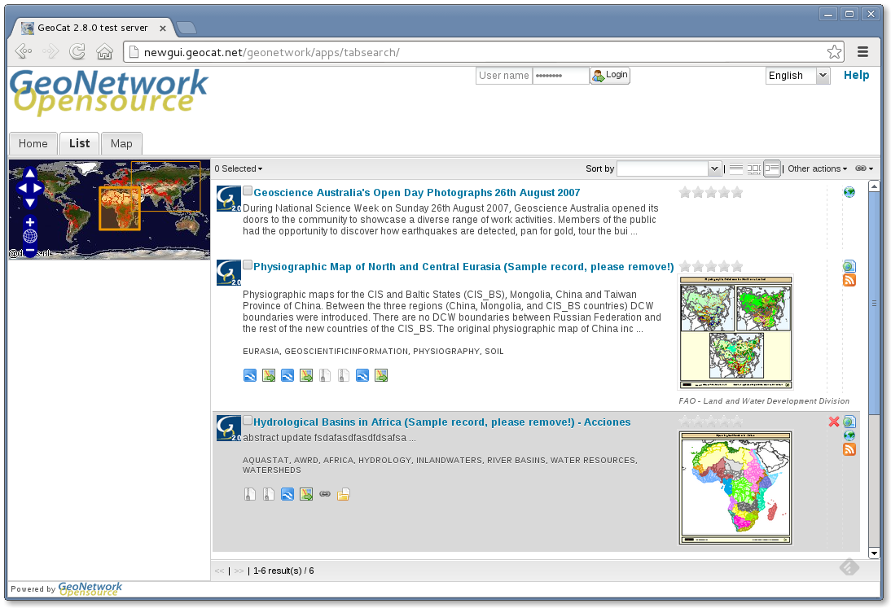
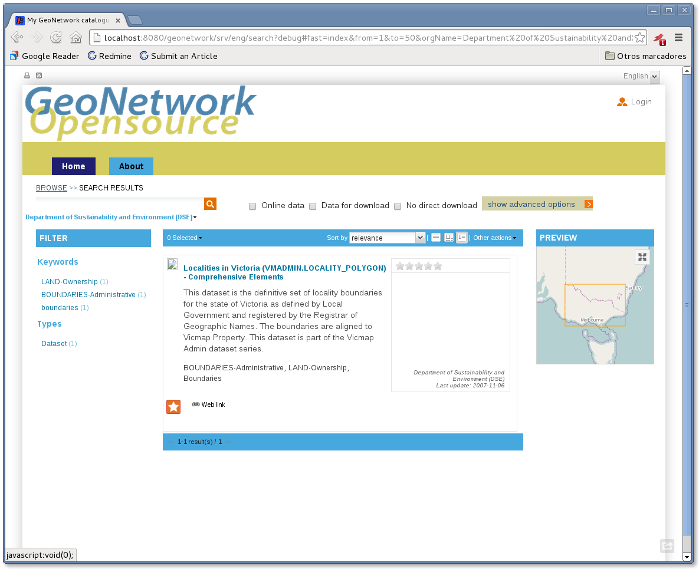

# User Interface {#userinterface}

There are four different user interfaces on geonetwork:

-   **Classic** - Perfect for hard environments, uses less javascript.
-   **Search** - Uses the new widgets library. More responsive than the classic UI. [Example Search](http://newgui.geocat.net/geonetwork/apps/search/)
-   **TabSearch** - Similar to the **Search** UI, but desktop-like as it uses tabs. [Example TabSearch](http://newgui.geocat.net/geonetwork/apps/tabsearch/)
-   **HTML5UI** - Also based on widgets, makes use of latest web technologies.

Compatibility table:

| Compatibility | > IE  |       |       |       | > Chrome | > Firefox | > Safari  |
| ------------- | ----- | ----- | ----- | ----- | -------- | --------- | --------- |
|               | > 7   | > 8   | > 9   | > 10  |          |           |           |
| Classic       | > X   | > X   | > X   |       | > X      | > X       | > X       |
| Search        | > X   | > X   | > X   |       | > X      | > X       | > X       |
| TabSearch     | > X   | > X   | > X   |       | > X      | > X       | > X       |
| HTML5UI       | > x   | > X   | > X   |       | > X      | > X       | > X       |

Full compatibility: X

Compatibility with penalties: x

Blank spaces means no information provided for that case.

## Classic

This is the default user interface in GeoNetwork. It is a complete user interface with all the functionalities the rest of the user interfaces have, but it is prepared to work on the hardest environments, using as less javascript and Ajax as possible, for example.

You don't have to do anything special to run this user interface, as it is the default one.

## Search

To use this UI, you have to compile the web project with **widgets** profile activated, like:

:   mvn clean package -Pwidgets

-   [Widgets](widgets/index.md)

## TabSearch

To use this UI, you have to compile the web project with **widgets-tab** profile activated, like:

:   mvn clean package -Pwidgets-tab

-   [Widgets](widgets/index.md)

## HTML5UI

To use this UI, you have to compile the web project with **html5ui** profile activated, like:

:   mvn clean package -Phtml5ui

-   [Widgets](widgets/index.md)
