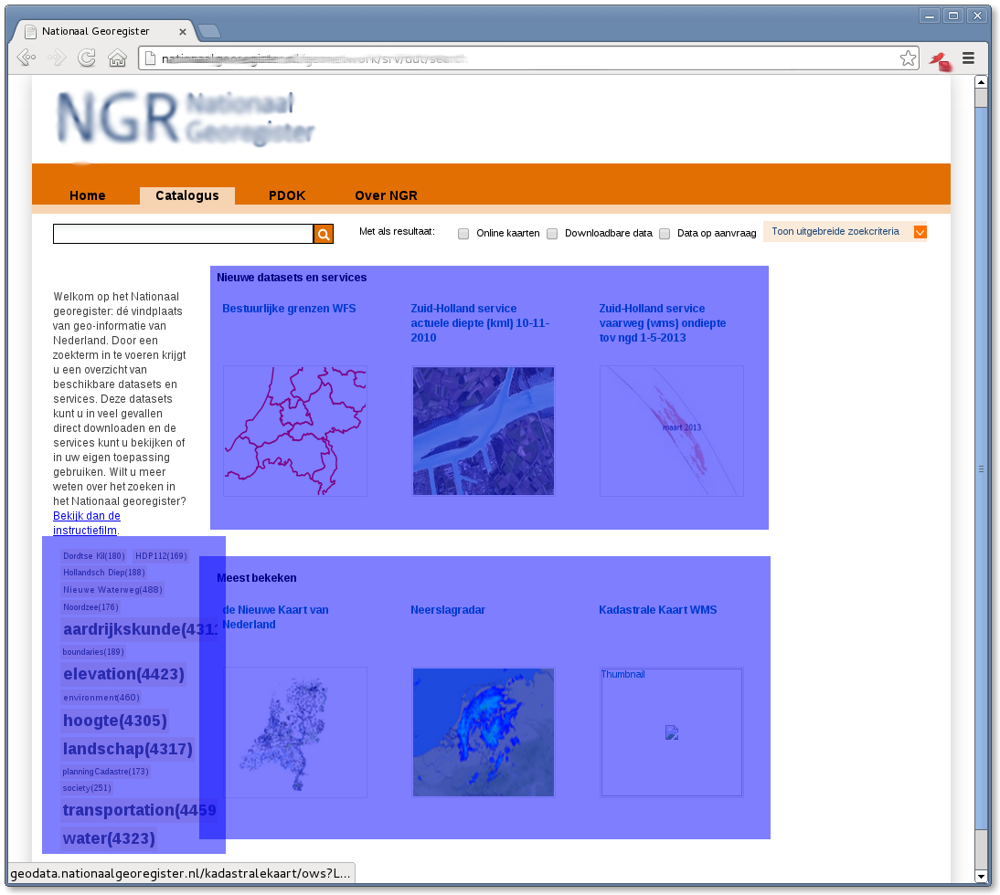

# Widgets

The GeoNetwork widget framework provides a list of independent pieces of code that let you build a geonetwork user interface.

## Add widget

Widgets are (usually) pieces of html that will be shown on your user interface. You should place them in some html structure so they are visually arranged.

The widgets are prepared with some configuration options, so you can select some of the visual aspects. For example, on the picture above, you an select the number of tags on the cloud or the number of items shown on the "latest" section.

To add a widget you should wait for the page to be loaded. This may be approached with the onReady function of ExtJS:

    Ext.onReady(function() {
       new GeoNetwork.TagCloudView({
            catalogue : catalogue,
            query : 'fast=true&summaryOnly=true&from=1&to=4',
            renderTo : 'cloud-tag',
            onSuccess : 'app.loadResults'
        });
    });

On this example, we just have to set up four properties on the constructor: the catalogue variable which makes all , the query which will be sent to the server to provide the items to show, the renderTo id of the div where the tag cloud will be drawn and the onSuccess function which will decorate and give style to the results of the tag cloud search.

You can find the whole [API of widgets here.](./../../../../widgets)

## Create a new widget

You can create new widgets to add to your customized user interface. Using the same example as before, you can see that you can easily create new widgets.

You just have to take care of two things:

> -   Visualization: define an html div where your widget will display information
> -   Manipulation of information: add some functionality (like a search connector) so the visualization has data to show.

## Using outside GeoNetwork

Although it is a testing functionality, in fact you can use this same widgets on your own webpage. You just have to make sure that all dependencies are fulfilled and the settings are properly set up.

As development will go on, this functionality will be made easier and documentation will be filled up.

//TODO some simple examples
