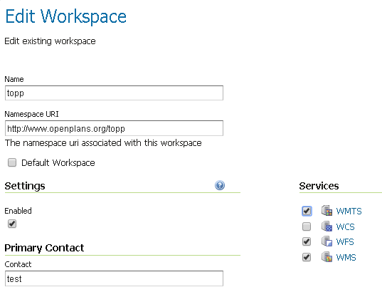
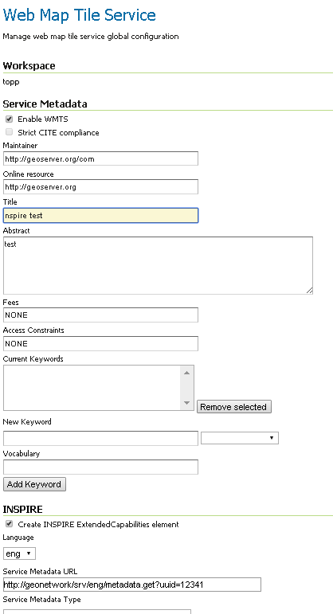
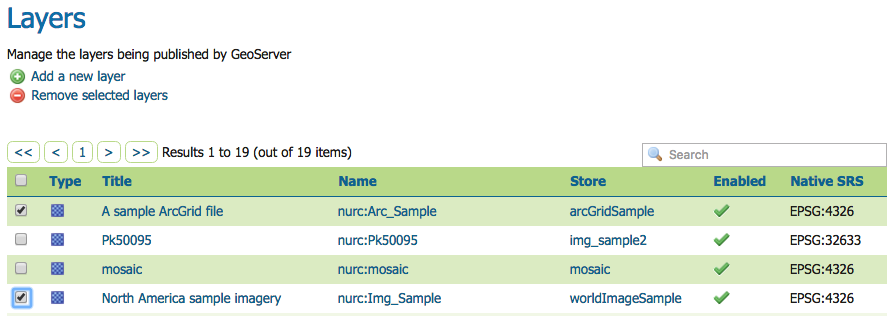
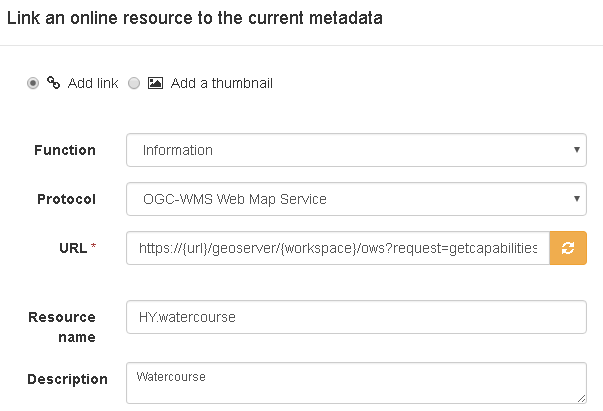

# Setting up INSPIRE view service with GeoNetwork and GeoServer {#tuto-view-geoserver}

This tutorial shows how one can set up a combination of GeoServer and GeoNetwork to provide view services following [technical guidelines for view services](http://inspire.ec.europa.eu/documents/Network_Services/TechnicalGuidance_ViewServices_v3.1.pdf).

Note that the technical guidelines allow both [WMS](http://www.opengeospatial.org/standards/wms) as well as [WMTS](http://www.opengeospatial.org/standards/wmts). Select the service type which matches your use case or both. WMTS is generally the preferred choice for bigger datasets (facilitates to meet the quality of service requirements). WMS is generally the better choice for datasets with a high update frequency. GeoServer has improved its WMTS support in recent versions (2.10+). Older versions can not be used for providing WMTS according to INSPIRE technical guidelines.

## GeoServer

Download and install GeoServer INSPIRE extension as documented in [installing inspire extension](http://docs.geoserver.org/latest/en/user/extensions/inspire/installing.html)

Create a workspace from which the INSPIRE layers will be hosted. On workspace properties activate "Settings" and set the selected services (WMS/WMTS). Limit the number of projections to the required INSPIRE projections. Keeping all default geoserver projections will cause serious performance issues.

On WMS/WMTS settings, select the INSPIRE workspace and fill out the form (keep service metadata url empty for now) as described in [using inspire extension](http://docs.geoserver.org/latest/en/user/extensions/inspire/using.html#inspire-using). If the INSPIRE workspace is not in the pull down, return to previous step and make sure "Settings" is activated for the workspace. If the INSPIRE fields are not visible, make sure the INSPIRE extension is correctly installed.

Create layers as described in [layer management](http://docs.geoserver.org/latest/en/user/data/webadmin/layers.html)

## GeoNetwork

When deploying Geonetwork, make sure the GEMET thesauri are loaded and activate the INSPIRE editor as described in [inspire documentation](http://geonetwork-opensource.org/manuals/trunk/eng/users/administrator-guide/configuring-the-catalog/inspire-configuration.html).

In Admin > Settings activate the INSPIRE extension.

For each dataset that you are going to publish create an iso19115 record using the INSPIRE template. Link each record to the view service as created in geoserver: eg <https://%7Burl%7D/geoserver/%7Bworkspace%7D/ows?request=getcapabilities&service=wms&version=1.3.0>

Make sure the metadata contains the same gmd:code (and authority) as used in WMS getcapabilities.

Create an OGC harvester that is able to extract a metadata for service (iso19119) record from the WM(T)S. Run the harvester and note down the identifier of the created service metadata.

## Return to GeoServer

For each layer add a link to the metadata of type application/vnd.ogc.csw.GetRecordByIdResponse_xml.

On the WM(T)S-settings > INSPIRE workspace add a link to the service metadata

## Validate the implementation

If you are running the above setup online, you can use the [pilot JRC INSPIRE validator](http://inspire-geoportal.ec.europa.eu/validator2/). If the above setup is running locally, you can use [Esdin Test Framework](https://github.com/Geonovum/etf-test-projects-inspire) to validate the INSPIRE setup.

Running the test frequently during development helps to identify issues in an early stage.

## Known issues

There is a known issue in the capabilities to metadata linkage. The JRC validator requires a gmd:RS_Identifier inside gmd:code having the authority and dataset identifier modeled separately. However the technical guidelines suggest a gmd:MD_Identifier inside gmd:code, the authority can then be included as a prefix, eg < gmd:MD_Identifier >{authority}#{uuid}< gmd:MD_Identifier >
