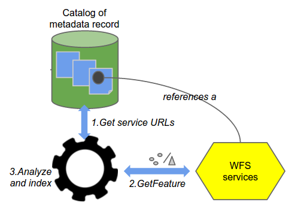
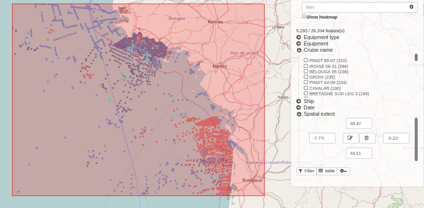

# Analyze and visualize data {#analyzing_data}

## Data accessible using download services (WFS)

All datasets described in metadata records and accessible through a download services (ie WFS) can be analyzed to improve search and data visualization. The catalog collect WFS features and index them.

Elasticsearch needs to be installed and configured (See [Installing search platform](/install-guide/installing-index.md)).

Once collected, filtering is available in the map viewer for this layer. The filter interface provides faceting and export capabilities. The map viewer tries to connect to a WFS service by substituting WMS by WFS in the service URL. If a WFS service is responding with a feature type having the same name as the WMS, the filter panel provides the option to index the features. User needs to be identified to run the indexing task.

Once indexed, all users can access the filtering menu providing:

-   a full text search on all fields
-   a control to display or not the heatmap
-   facets on all fields (computing automatically range facet for numbers)
-   table action display all values
-   filter action apply the filters to the WMS layers using SLD

Click on the table menu to display the attributes. Double click a row in the table to zoom to a feature.

Spatial filters can also be applied.

## Feature type customization

By default, the filter panel is generated from Elasticsearch index. But you customise it for a specific WFS Feature Type.

The customisation is done by a JSON config inserted in the gmd:applicationProfile section of the online resource in the metadata.

Here the options:

    {
    "fields": [{
      "name": "PNT_PROF",
      // non disponible actuellement
      "type": "double",
      "fq" : {
        "facet.interval": "PNT_PROF_d",
        "facet.interval.set": ["[0,10]", "(10,10000]"],
       or
        "facet.range": "PNT_PROF_d",
        "facet.range.start": "0",
        "facet.range.end": "10000",
        "facet.range.gap": "300"
       or
        "facet.range": "PNT_PROF_d",
        "facet.range.classes": "5" // Get min, max and compute gap on 5 classes
      }
    }, {
      "name": "GRIDCODE"
    }, {
      "name": "LABEL",
      "label" : {"fr": "monLabel", "en": "myLabel"}
    }],
    "tokenize": {"GRIDCODE": ",", "PARCELLE": "/"},
    "heatmap": true
    }

You can

-   restrict the fields used for filter
-   specify your own ranges for numeric values
-   set your label
-   manage tokenized fields
-   enable heatmap
