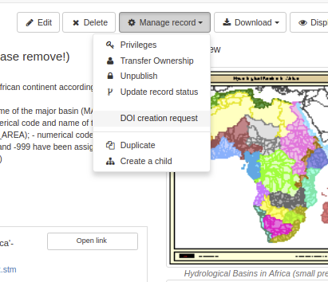
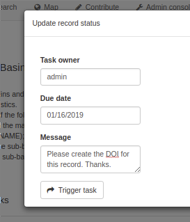
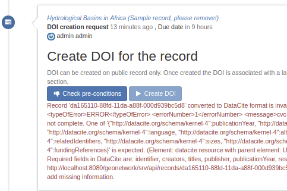
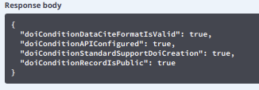

# Digital Object Identifier (DOI) {#doi}

## Configuration

The catalogue support DOI creation using:

-   [DataCite API](https://support.datacite.org/docs/mds-api-guide).
-   EU publication office API <https://ra.publications.europa.eu/servlet/ws/doidata?api=medra.org>

Configure the API access point in the `admin console` --> `settings`:

A record can be downloaded using the DataCite format from the API using: <http://localhost:8080/geonetwork/srv/api/records/da165110-88fd-11da-a88f-000d939bc5d8/formatters/datacite?output=xml>

## Creating the DOI

Once configured, DOI can be created using the interface. DOI is created on demand. It means that a user must ask for creation of a DOI. When created, the task is notified by email to the reviewer of the group (by default, can be configured for administrator only using the notification level of the task).

The task is assigned to a specific user. An optional due date and comment can be defined:

After submission of the task, the task owner is notified by email (if the mail server is configured, see admin console --> settings). The task can then be resolved in the admin console ---> information --> versioning section.

If the configuration is missing or wrong, the error is reported:

For DOI creation, the task is a 2 steps actions:

-   First check if all prerequisite are covered (below the record is not valid in DataCite format).

The DataCite format requires some mandatory fields:

-   Identifier (with mandatory type sub-property)
-   Creator (with optional given name, family name, name identifier and affiliation sub-properties)
-   Title (with optional type sub-properties)
-   Publisher
-   PublicationYear
-   ResourceType (with mandatory general type description subproperty)

The mapping with ISO standards is the following:

| Property        | ISO 19139                                                                                                             | ISO 19115-3                                                                                                           |
|-----------------|-----------------------------------------------------------------------------------------------------------------------|-----------------------------------------------------------------------------------------------------------------------|
| Identifier      | ``gmd:MD_Metadata/gmd:fileIdentifier/*/text()``                                                            | ``mdb:MD_Metadata/mdb:metadataIdentifier/*/mcc:code/*/text()``                                            |
| Creator         | ``gmd:identificationInfo/*/gmd:pointOfContact`` with role 'pointOfContact' or 'custodian'              | ``mdb:identificationInfo/*/mri:pointOfContact`` with role 'pointOfContact' or 'custodian'              |
| Title           | ``gmd:identificationInfo/*/gmd:citation/*/gmd:title``                                                     | ``mdb:identificationInfo/*/mri:citation/*/cit:title``                                                     |
| Publisher       | ``gmd:distributorContact[1]/*/gmd:organisationName/gco:CharacterString``                                 | ``mrd:distributorContact[1]/*/cit:party/*/cit:organisationName/gco:CharacterString``                    |
| PublicationYear | ``gmd:identificationInfo/*/gmd:citation/*/gmd:date/*[gmd:dateType/*/@codeListValue = 'publication'`` | ``mdb:identificationInfo/*/mri:citation/*/cit:date/*[cit:dateType/*/@codeListValue = 'publication'`` |
| ResourceType    | ``gmd:hierarchyLevel/*/@codeListValue`` `                                                                 | mdb:metadataScope/*/mdb:resourceScope/*/@codeListValue`                                                              |

The mapping can be customized in:

-   ISO19139 `schemas/iso19139/src/main/plugin/iso19139/formatter/datacite/view.xsl`
-   ISO19115-3.2018 `schemas/iso19139/src/main/plugin/iso19139/formatter/datacite/view.xsl`

See <http://schema.datacite.org/meta/kernel-4.1/doc/DataCite-MetadataKernel_v4.1.pdf> for more details on the format.

DataCite API return XSD validation error.

The catalogue also allow to apply DataCite validation in the editor:

A DOI may already be assigned for a record:

In such case the DOI can be updated. If the DOI is already assigned in a metadata record, editors can also update the DOI from the editor:

After validation, create the DOI

Once created, a link to the DOI and to the DataCite document is available:

The DOI is then added to the metadata record:

## DOI API

The REST API allows to access the DOI related operations:

The check preconditions API returns exception if one of the pre requisite is not met:

-   DataCite API is not configured
-   Record is not public
-   Record already has a DOI
-   Record is not valid for DataCite (ie. XSD errors returned by DataCite XSD validation)

When a DOI is created, the response return the following details:

The DOI is added to the metadata record using the following encoding:

## Examples

-   [Comment créer un DOI à partir de l'outil de catalogage Geonetwork, Annick Battais](https://sist19.sciencesconf.org/data/pages/SIST19_A_BATTAIS.pdf)
