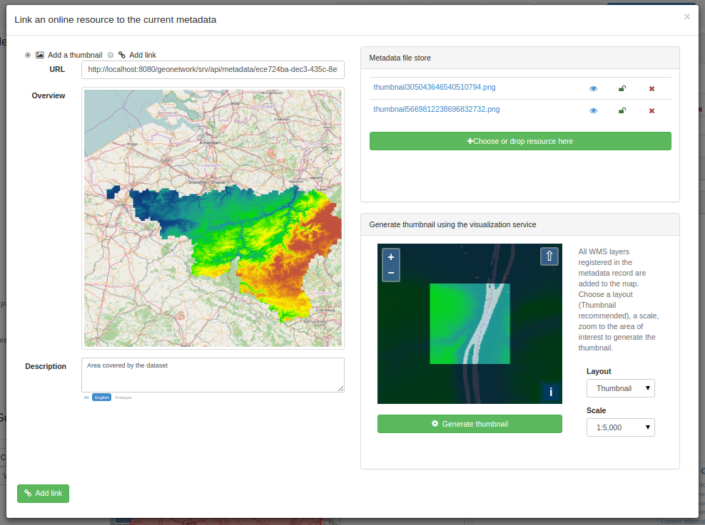

# Illustrating with an overview {#linking-thumbnail}

To help the user identify a metadata record of interest, you can create a graphic overview (or thumbnail) in the form of an image and attach it to the metadata record. For example, if your metadata record describes some geographic dataset then the graphic overview could be an image of the map with legend produced by an OGC Web Map Service.

You can associate one or more overviews with a record.

Thumbnails are displayed in search results and metadata view:

From the `Associated resources` panel, click on the `Add a document` button to open the `Link an online resource to the current metadata` wizard. Thumbnails can be added using 3 sources:

-   From a URL on the web
-   From a file attached to the metadata
-   From a file generated using a visualization service

## Linking an overview with a URL

When the overview is available as an image on the web, it could be directly linked to the metadata record. Add an optional description to describe the image:

If the overview is not available, attache an image (png, gif, jpeg) within the filestore (see [Uploading attachments](/user-guide/associating-resources/using-filestore.md)) and click its name to set the URL:

You can link as many images as you want. Images associated in this mode, should be publicly accessible on the web if you want the overviews to be displayed properly even if that metadata record get harvested by other catalogs.

## Generating a thumbnail using WMS layers {#linking-thumbnail-from-wms}

If you have registered a WMS layer in the current metadata record (see [Linking a WMS layer](/user-guide/associating-resources/linking-online-resources.rst#linking-wms-layer)), a thumbnail can be generated using it on top of the base layer map. Choose the `Create thumbnail` tab and choose the area to be print on the thumbnail. The image created is added to the filestore.

