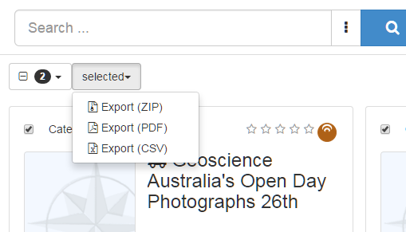

# Exporting records {#export}

GeoNetwork has three different export options to export metadata. They operate on selected sets of metadata from the search results. As such they are accessible from the "actions on selection" menu as shown in the following example:



## Export as a ZIP archive

When a selected set of metadata records is exported as a ZIP archive, each metadata record is inserted in the ZIP archive as a directory containing the metadata, any data uploaded with the metadata record and the thumbnails. This type of ZIP archive is the MEF (Metadata Exchange Format) Version 2.0. You can find more details of MEF V2 in the GeoNetwork Developers Manual.

## Export as a CSV file

When a selected set of metadata records is exported as a CSV/TXT file, the following process takes place for each metadata record:

-   a brief summary of some of the elements from each selected metadata record is generated by applying the brief template from the metadata schema. The main folder of the different available schema is `GEONETWORK_DATA_DIR/config/schema_plugins/`. In particular, for an iso19115-3.2018 it is located here: `GEONETWORK_DATA_DIR/config/schema_plugins/iso19115-3.2018/layout/tpl-csv.xsl`
-   the elements common to the brief summary elements for all metadata records are extracted (as they may differ according to the metadata schema)
-   a title record with comma separated element names is created
-   the content of each element is laid out in comma separated form. Where there is more than one child element in the brief element (eg. for geoBox), the content from each child element is separated using '###'.

An example of an ISO metadata record in CSV format is shown as follows:

    "schema","uuid","id","title","metadatacreationdate","geoBox"

    "iso19115-3.2018","27b5f8b8-053a-11ea-aa46-02000a08f492","1312","S2A_MSIL1C_20161218T102432_N0204_R065_T32TMS_20161218T102606","2019-11-12T10:49:52,"7.691141905380134###9.128266945124432###45.958258688896564###46.95363733424615"

It is possible to override the brief summary of metadata elements by creating a special template in the presentation XSLT of the metadata schema. As an example of how to do this, we will override the brief summary for the iso19115-3.2018 schema and replace it with other possible useful information.

In the case of iso19115-3.2018 there are the two files to be modified:

1.  geonetwork/WEB-INF/data/config/schema_plugins/iso19115-3.2018/layout/tpl-csv.xsl
2.  geonetwork/xslt/services/csv/csv-search.xsl

For example, to export the following elements:

`"uuid","title","cloud_coverage_percentage","category","date-creation"`

in the first file, it is necessary to proceed as in the following:

-   to comment the elements `id, title, abstract` except

```{=html}
<!-- -->
```
    <uuid>
          <xsl:value-of select="gn:info/uuid"/>
    </uuid>

-   to add a similar line in between the abstract and category elements:

```{=html}
<!-- -->
```
    <myfield>myfieldvalue</myfield>

For example:

    <title>
       <xsl:copy-of select="mdb:identificationInfo/*/mri:citation/*/cit:title"/>
    </title>
    <cloud_coverage_percentage>
       <xsl:copy-of select="mdb:contentInfo/mrc:MD_ImageDescription/mrc:cloudCoverPercentage/gco:Real"/>
    </cloud_coverage_percentage>
    <category>
      <xsl:value-of select="mdb:metadataScope/*/mdb:resourceScope/*/@codeListValue"/>
    </category>

About cloud coverage percentage, in particular, please remember to add the namespace if missing:

`xmlns:mrc="http://standards.iso.org/iso/19115/-3/mrc/2.0"`

If not interested in other information, please comment all other lines except:

    <xsl:copy-of select="gn:info"/>

because it is used to sort results by schema.

About the second file, *csv-search.xsl*, to avoid printing automatically the 3 columns:

`"schema","uuid","id",`

you have to comment the following lines:

    <xsl:text>"schema"</xsl:text>
    <xsl:value-of select="$sep"/>
    <xsl:text>"uuid"</xsl:text>
    <xsl:value-of select="$sep"/>
    <xsl:text>"id"</xsl:text>
    <xsl:value-of select="$sep"/>

and

    <xsl:value-of select="concat('&quot;', $metadata/geonet:info/schema, '&quot;', $sep, 
    '&quot;', $metadata/geonet:info/uuid, '&quot;', $sep, 
    '&quot;', $metadata/geonet:info/id, '&quot;', $sep)"/>

These changes will create the desired output:

    "uuid","title","cloud_coverage_percentage","category","date-creation"  
    "c94da70e-066e-11ea-aa22-02000a08f492","S2A_MSIL1C_20180320T101021_N0206_R022_T33TUM_20180320T122057","36.0368","dataset","2018-03-20T12:20:57",
