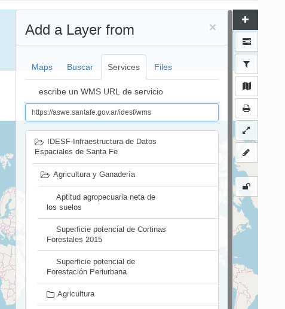

# Maps and dataset visualisation {#map-viewer-as-user}

You can use the map components in GeoNetwork in following ways:

-   The map viewer provides a way for users to interactively assess the relevance of a resource discovered in the catalog.
-   GeoNetwork can be used as a mapping application to create maps that can be printed or shared with others. You can also register the maps as assets in the catalogue.

!!! note

    Instead of using the embedded map viewer, GeoNetwork can use an external map viewer (for example an existing WebGIS framework in your organisation). An administrator can configure GeoNetwork to connect it to an external web map application. For such configurations, all map interaction is delegated to the external application. See [Map Application](/administrator-guide/configuring-the-catalog/user-interface-configuration.rst#user-interface-config-mappage).

## Map viewer

You can open the map viewer from a metadata details view using the 'add to map' button or directly from the map tab. A list of tools display in the right toolbar. Hover over the tools to display a tooltip explaining their meaning. The tools that are available are configured by the administrator, see [Map Application](/administrator-guide/configuring-the-catalog/user-interface-configuration.rst#user-interface-config-mappage).

Tools for using the Map are arranged in two groups in the right-hand side of the map. The top group looks like this:

| **Tool**               | **Description**                                                                                                                                                                                           |
|------------------------|-----------------------------------------------------------------------------------------------------------------------------------------------------------------------------------------------------------|
| Add Layer              | You can search the catalog, add layers from web services, or kml. It is possible to add directly WMS, WFS or WMTS layers by entering the endpoint and selecting the layer from the capabilities response. |
| Manage Layer           | Manage layers or Change the background map.                                                                                                                                                               |
| Projection switcher    | Allows you to set alternative projections.                                                                                                                                                                |
| Filter layers          | Used to filter features shown on the map on various attributes. As an administrator make sure the filtering is correctly set up before adding this tool to the map..                                      |
| Web Processing Service | You can enter a WPS link and see what processes the service offers.                                                                                                                                       |
| Manage the Map         | Setting the map back to default settings, loading a new map definition, downloading the current map, or saving the map configuration as a record in the catalog..                                         |
| Print                  | A pdf of the current map will be generated, to be downloaded and send to a printer.                                                                                                                       |
| Synchronise            | Layers with the small map on the Search tab. Changes on the map are duplicated on the small map and vice versa.                                                                                           |
| Measure distances      | Measure distances and surfaces in the map.                                                                                                                                                                |
| Draw annotations       | Annotations can be printed or exported as GeoJSON.                                                                                                                                                        |

Additionally there is a *geographic search* tool in the top left.

The map viewer supports *Featureinfo*, to retrieve information by clicking on a location in the map.

{width="300px"}

## Storing and sharing maps

A map consists of a background layer and a number of thematic overlays. A format to combine layers, projection and bounds (area of interest) has been adopted by OGC as the OWS Context standard. Besides GeoNetwork there are a number of other applications supporting this standard.

GeoNetwork uses OWSContext to store, share and load maps:

-   Export a context to a local file, to restore the map later or share by email.
-   The administrator can introduce a context file as default configuration for the catalog.
-   Open a local context file by dragging it on to the map viewer (or open from context menu).
-   Register a context as asset in the catalogue, the context itself will be added as attachment.
-   Records that have an OWS context file attached will display a button to open the context file.

{width="300px"}
