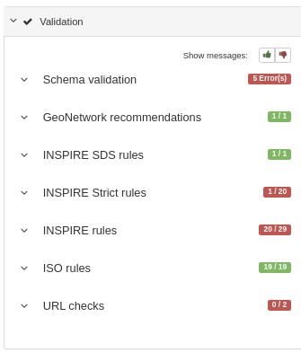

# Validating records {#validation}

1.  In the metadata editor, click Validate to trigger the validation. The right panel displays all validation results by levels:

1.  Click the thumbs up or down icons to display errors. Errors reported in blue are for information only and do not affect the global validation of the record:

    

    The editor also reports error messages where applicable (as all error messages cannot be shown in the editor):

    

2.  Once a record is validated, the validation status is saved and is displayed in the editor board page:

    

You can filter the Validation status using a facet in the editor board.

## Configuring validation

Catalog administrators can force validation every time an editor exits or closes the metadata editing interface (see [System configuration](/administrator-guide/configuring-the-catalog/system-configuration.rst)). To configure validation levels (see [Configuring validation levels](/administrator-guide/managing-metadata-standards/configure-validation.md)). In case of INSPIRE records, you can use remote validator (see [INSPIRE validation](/administrator-guide/configuring-the-catalog/inspire-configuration.rst#inspire-validation))
