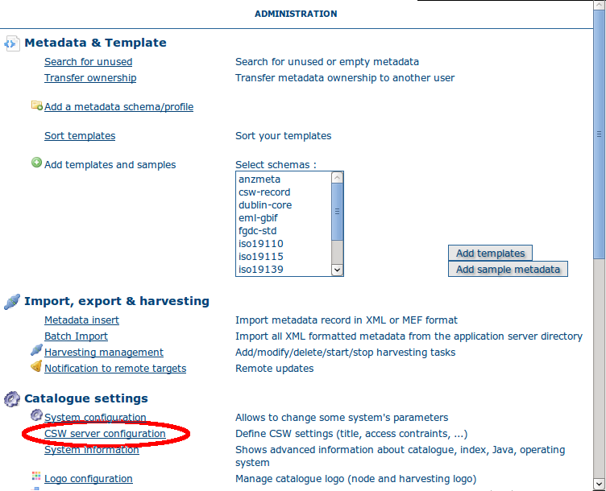
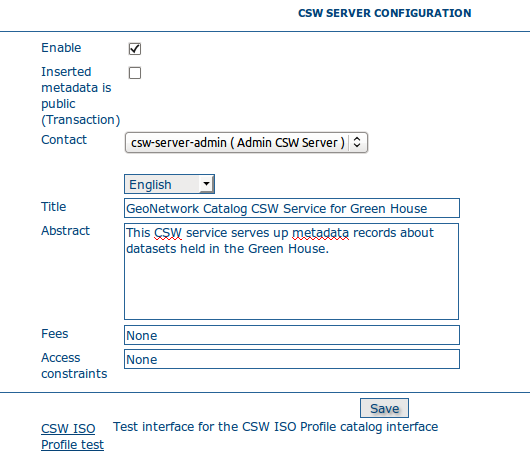

# OGC CSW server configuration {#csw_configuration}

To get to the CSW server configuration, you must be logged on as administrator first. Open the Administration page and select CSW Server configuration (The link is surrounded with a red ellipse in the image below).

Clicking on this link will open a configuration menu that looks like the following.

The Open Geospatial Catalogue Service for the Web (OGC-CSW) service, is a self-describing service that allows query, update and insertion of metadata records. The service can be asked to provide a description of itself, the human who administers it and other information through a GetCapabilities request (eg. <http://localhost:8080/geonetwork/srv/en/csw?request=GetCapabilities&service=CSW&version=2.0.2>). This form allows you to configure the CSW server and fill out some of the properties returned in response to a GetCapabilities request. A description of each of the fields in this form now follows:

*Enable*: This option allows you to start or stop the CSW services. If this option is disabled, other catalogues cannot connect to the node using CSW protocol.

*Inserted metadata is public*: By default, metadata inserted with the CSW Harvest and CSW Transaction operations is not publicly viewable. A user with the appropriate access rights could do this after the CSW Harvest and CSW Transaction operations, but this is not always convenient. If this option is checked all metatada inserted using the CSW Harvest and CSW Transaction operations will be publicly viewable.

*Contact*: The drop down select list shows the current users in the local GeoNetwork catalog. The contact details of the user chosen from this list will be provided in the GetCapabilities document of the CSW service.

*Language*: The language that is used in the service description fields.

*Title*: The title of the CSW service.

*Abstract*: The abstract of the CSW service. The abstract can contain a brief description of what the service provides and who runs it.

*Fees*: If there are any fees for usage of the service then they should be detailed here.

*Access constraints*: If there are any constraints on access to the service then they should be detailed here.

The last function on this page is the CSW ISO Profile test. Clicking on this link brings up a javascript based interface that allows you to submit requests to the CSW server. The requests used by this interface are XML files in INSTALL_DIR/web/geonetwork/xml/csw/test.

## Virtual CSW server entry points {#VirtualCSW}

This feature of CSW server adds the capability to create custom CSW entry points that apply extra criteria to the CSW requests, allowing to implement several useful cases like, for example:

-   Define an INSPIRE CSW entry point to deliver only the INSPIRE related metadata stored in the catalog.
-   Define CSW entry points to deliver only metadata related to specific theme/s: climate, boundaries, etc.

The CSW service entry points are defined in the configuration file `WEB-INF/config-csw-servers.xml` using the following syntax:

    <service name="csw-with-my-filter-environment">
       <class name=".services.main.CswDispatcher" >
               <param name="filter" value="+inspirerelated:on +themekey:environment"/>
       </class>
    </service>

    <service name="csw-with-my-filter-climate">
       <class name=".services.main.CswDispatcher" >
               <param name="filter" value="+inspirerelated:on +themekey:climate"/>
       </class>
    </service>

The `filter` parameter value should use the Lucene query parser syntax (see <http://lucene.apache.org/java/2_9_1/queryparsersyntax.html>) and is use in these CSW operations:

-   *GetRecords*: the `filter` is applied with the CSW query as an extra query criteria.
-   *GetRecordById*: the `filter` is applied with the metadata `id` requested as an extra query criteria.
-   *GetDomain*: the `filter` is applied as a query criteria to retrieve the metadata properties requested.
-   *GetCapabilities*: the `filter` is applied as a query criteria to fill the metadata keywords list in the GetCapabilities document.

The list of available Lucene index fields to use in the `filter` parameter can be obtained from the files `index-fields.xsl` in the schema folders located in `WEB-INF/xml/schemas`.

As Harvest and Transaction operations are not affected by `filter` parameter, to avoid confusion is better to use this feature as readonly CSW endpoints.

### Configuration

Adding a new CSW entry point to GeoNetwork opensource requires these steps (suppose the new CSW entry point is call `csw-with-my-filter-environment`):

-   Create the service definition in the configuration file `WEB-INF/config-csw-servers.xml` with the custom filter criteria as describe before:

        <service name="csw-with-my-filter-environment">
           <class name=".services.main.CswDispatcher" >
                   <param name="filter" value="+inspirerelated:on +themekey:environment"/>
           </class>
        </service>

-   Define permissions for the service in the file `WEB-INF/user-profiles.xml` file:

        <profile name="Guest">
           <allow service="csw-with-my-filter-environment"/>

-   Restart the application. The new CSW entry point is accessible in <http://localhost:8080/srv/en/csw-with-my-filter-environment>

### Configuration using GeoNetwork overrides

In this section is described how to use GeoNetwork overrides feature to configure a new CSW entry point. This feature allows to use different configurations to handle multiple deployment platforms. See additional documentation of this feature in [Configuration override](../advanced-configuration/index.md#adv_configuration_overriddes).

-   Add the next override to a configuration override file, for example `WEB-INF/config-overrides-csw.xml`:

        <overrides xmlns:xsi="http://www.w3.org/2001/XMLSchema-instance">
         <!-- Add custom CSW service -->
         <file name=".*/WEB-INF/config-csw-servers.xml">
           <addXML xpath="services">
             <service name="csw-with-my-filter-environment">
               <class name=".services.main.CswDispatcher">
                 <param name="filter" value="+inspirerelated:on +themekey:environment"/>
               </class>
             </service>
           </addXML>
         </file>
         <file name=".*/WEB-INF/user-profiles.xml">
           <addXML xpath="profile[@name='Guest']">
             <allow service="csw-with-my-filter-environment"/>
           </addXML>
         </file>
        </overrides>

For more information about configuration overrides see [Configuration override](../advanced-configuration/index.md#adv_configuration_overriddes)

-   Restart the application. The new CSW entry point is accessible in <http://localhost:8080/srv/en/csw-with-my-filter-environment>
