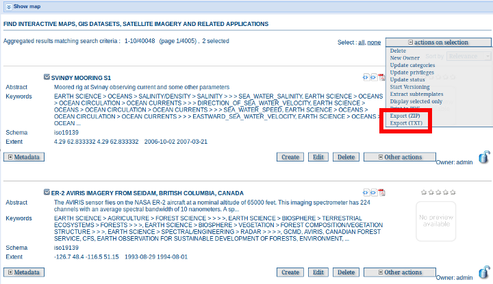

# Export facilities {#export}

GeoNetwork has two different types of export function - both of which operate on selected sets of metadata from the search results. As such they are accessible from the "actions on selection" menu as shown in the following example:

*The export functions: ZIP and CSV - highlighted*

## Export as a ZIP archive

When a selected set of metadata records is exported as a ZIP archive, each metadata record is inserted in the ZIP archive as a directory containing the metadata, any data uploaded with the metadata record and the thumbnails. This type of ZIP archive is the MEF (Metadata Exchange Format) Version 2.0. You can find more details of MEF V2 in the GeoNetwork Developers Manual.

## Export as a CSV file

When a selected set of metadata records is exported as a CSV/TXT file, the following process takes place for each metadata record:

-   a brief summary of some of the elements from each selected metadata record is generated by applying the brief template from the metadata schema eg. for an iso19139 metadata record the brief template from `GEONETWORK_DATA_DIR/config/schema_plugins/iso19139/present/metadata-iso19139.xsl` would be applied to the metadata record.
-   the elements common to the brief summary elements for all metadata records are extracted (as they may differ according to the metadata schema)
-   a title record with comma separated element names is created
-   the content of each element is laid out in comma separated form. Where there is more than one child element in the brief element (eg. for geoBox), the content from each child element is separated using '###'.

An example of an ISO metadata record in CSV format is shown as follows:

    "schema","uuid","id","title","geoBox","metadatacreationdate"
    "iso19139","6ad9e3b8-907e-477b-9d82-1cc4efd2581d","17729","ER-2 AVIRIS Imagery","-126.7###-116.5###48.4###51.15","2001-12-10"

It is possible to override the brief summary of metadata elements by creating a special template in the presentation XSLT of the metadata schema. As an example of how to do this, we will override the brief summary for the iso19139 schema and replace it with just one element: gmd:title. To do this we create an XSLT template as follows:

    <xsl:template match="gmd:MD_Metadata" mode="csv">
      <xsl:param name="internalSep"/>
      <metadata>
        <!-- add in our field -->
        <xsl:copy-of select="gmd:identificationInfo/gmd:MD_DataIdentification/gmd:citation/gmd:CI_Citation/gmd:title"/>
        <!-- copy geonet:info element in - has special metadata eg schema name  -->
        <xsl:copy-of select="geonet:info"/> 
      </metadata>
    </xsl:template>

This template, when added to `GEONETWORK_DATA_DIR/config/schema_plugins/iso19139/present/metadata-iso19139.xsl`, will replace the brief summary (produced by the brief template) with just one element, gmd:title.
