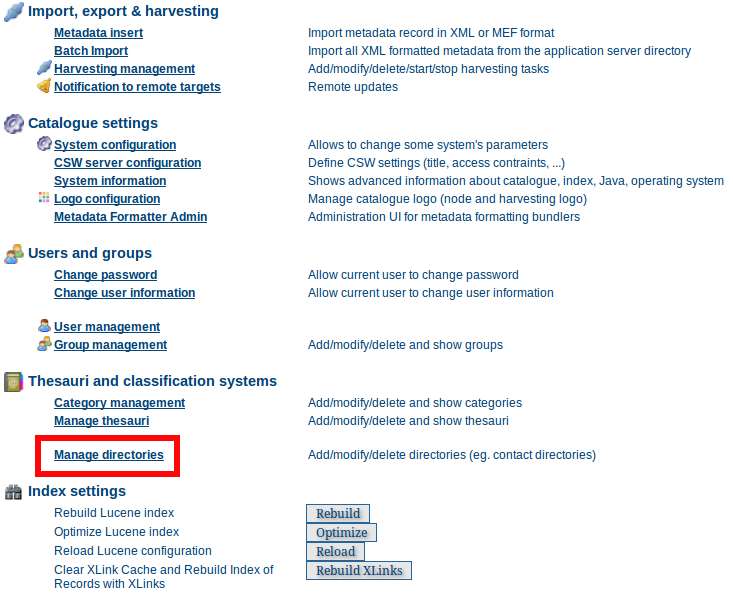
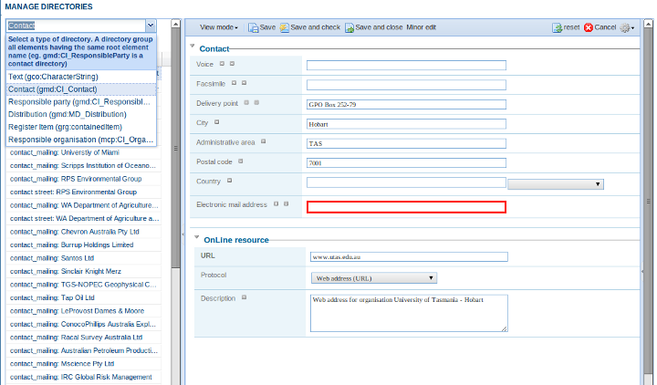
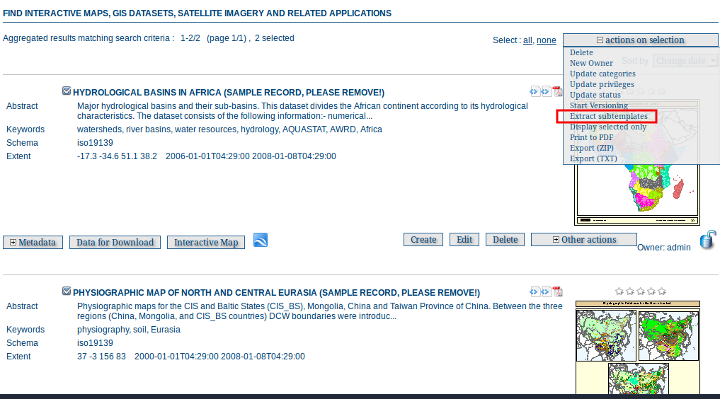
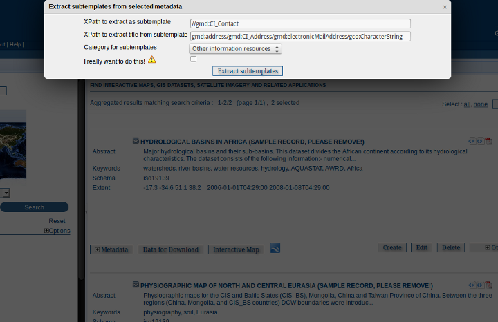
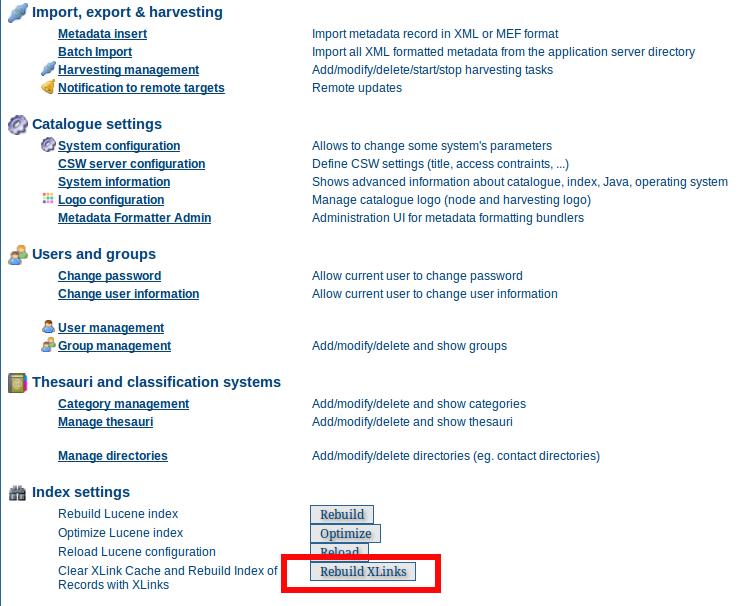

# Fragments

GeoNetwork supports metadata records that are composed from fragments of metadata. The idea is that the fragments of metadata can be used in more than one metadata record.

Here is a typical example of a fragment. This is a responsible party and it could be used in the same metadata record more than once or in more than one metadata record if applicable.

    <gmd:CI_ResponsibleParty xmlns:gmd="http://www.isotc211.org/2005/gmd" xmlns:gco="http://www.isotc211.org/2005/gco" >
      <gmd:individualName>
        <gco:CharacterString>John D'ath</gco:CharacterString>
      </gmd:individualName>
      <gmd:organisationName>
        <gco:CharacterString>Mulligan &amp; Sons, Funeral Directors</gco:CharacterString>
      </gmd:organisationName>
      <gmd:positionName>
        <gco:CharacterString>Undertaker</gco:CharacterString>
      </gmd:positionName>
      <gmd:role>
        <gmd:CI_RoleCode codeList="./resources/codeList.xml#CI_RoleCode" codeListValue="pointOfContact"/>
      </gmd:role>
    </gmd:CI_ResponsibleParty>

Metadata fragments that are saved in the GeoNetwork database are called subtemplates. This is mainly for historical reasons as a subtemplate is like a template metadata record in that it can be used as a 'template' for constructing a new metadata record.

Fragments are not handled by GeoNetwork unless xlink support is enabled. See [XLink resolver](../../admin/configuration/index.md#xlink_config) in the 'System Configuration' section of this manual. The reason for this is that XLinks are the main mechanism by which fragments of metadata can be included in metadata records.


Fragments may be created by harvesting (see [Harvesting Fragments of Metadata to support re-use](../harvesting/index.md#harvesting_fragments)), used in register thesauri (see [Preparing to edit an ISO19135 register record](../../features/thesaurus/index.md#xlinks_thesaurus)) and linked into metadata records using the GeoNetwork editor in the javascript widget interface.

This section of the manual will describe:

-   how to manage directories of subtemplates
-   how to extract fragments from an existing set of metadata records and store them as subtemplates
-   how to manage the fragment cache that GeoNetwork uses to speed up access to fragments that are not in the local catalogue

## Managing Directories of subtemplates

There are some differences between the handling of subtemplates and metadata records in GeoNetwork. Unlike metadata records, subtemplates do not have a consistent root element, the metadata schema they use may not be recognizable, they do not appear in search results (unless they are part of a metadata record) and they cannot be assigned privileges. But like metadata records, they are allocated an integer id and are stored in the GeoNetwork metadata table (with template field set to "s").

Because of these differences, a separate interface has been built to search, display and edit subtemplates in directories based upon their root element. The interface is accessed from the GeoNetwork "Administration" page. To access this page you need to be logged in as a GeoNetwork Administrator. The relevant part of the GeoNetwork Administration page is shown in the following screenshot with the directory interface highlighted.



*The subtemplate directory function on the Administration page*

Clicking on this link will bring up the directory interface. The directory interface allows you to browse the available subtemplates according to their root element or search for any subtemplate with content content containing the search term. A typical directory for a site is shown in the following screenshot.



Notice in the screenshot that we have selected the directory of subtemplates with the root element gmd:CI_Contact? The other directories for this particular site are also shown.

The edit interface shown in the right hand panel is self-explanatory.

## Extracting subtemplates from a metadata record

Many sites have existing metadata records with common information eg. contact information in an ISO CI_Contact element. Fragments such as these can be extracted from a selected set of metadata records using the "Extract subtemplates" function provided in the "actions on selected set menu".

To use this function the following set of steps should be followed:

-   Make sure you understand what an XPath is - see <http://www.w3schools.com/xpath/default.asp> for example.
-   Identify fragments of metadata that they would like to manage as reusable subtemplates in the metadata record. This can be done using an XPath. eg. the XPath `/gmd:MD_Metadata/gmd:contact/gmd:CI_ResponsibleParty/gmd:contactInfo/gmd:CI_Contact` identifies metadata contact information in iso19139 metadata records. An example of such a fragment (taken from one of the GeoNetwork sample records) is shown in the following example:

```{=html}
<!-- -->
```
    <gmd:CI_Contact>
      <gmd:phone>
        <gmd:CI_Telephone>
          <gmd:voice>
            <gco:CharacterString/>
          </gmd:voice>
          <gmd:facsimile>
            <gco:CharacterString/>
          </gmd:facsimile>
        </gmd:CI_Telephone>
      </gmd:phone>
      <gmd:address>
        <gmd:CI_Address>
          <gmd:deliveryPoint>
            <gco:CharacterString>Viale delle Terme di Caracalla</gco:CharacterString>
          </gmd:deliveryPoint>
          <gmd:city>
            <gco:CharacterString>Rome</gco:CharacterString>
          </gmd:city>
          <gmd:administrativeArea>
            <gco:CharacterString/>
          </gmd:administrativeArea>
          <gmd:postalCode>
            <gco:CharacterString>00153</gco:CharacterString>
          </gmd:postalCode>
          <gmd:country>
            <gco:CharacterString>Italy</gco:CharacterString>
          </gmd:country>
          <gmd:electronicMailAddress>
            <gco:CharacterString>jippe.hoogeveen@fao.org</gco:CharacterString>
          </gmd:electronicMailAddress>
        </gmd:CI_Address>
      </gmd:address>
    </gmd:CI_Contact>  

-   Identify and record the XPath of a field or fields within the fragment which text content will be used as the title of the subtemplate. It is important to choose a set of fields that will allow a human to identify the subtemplate when they choose to either reuse the subtemplate in a new record or edit in the subtemplate directories interface. This XPath should be relative to the root element of the fragment identified in the previous step. So for example, in the fragment above we could choose `gmd:address/gmd:CI_Address/gmd:electronicMailAddress/gco:CharacterString` as the title for the fragments to be created.
-   On the GeoNetwork home page, search for and then select the records from which the subtemplates will be extracted. Choose "Extract subtemplates" from the "actions on selection" menu as shown in the following screenshot:



-   Fill in the form with the information collected in the previous steps. It should look something like the following:



-   Run the extract subtemplate function in test mode (ie. without checking the "I really want to do this" box). This will test whether your XPaths are correct by extracting one subtemplate from the selected set of records and displaying the results.
-   If you are happy with the test results, go ahead with the actual extraction by checking the "I really want to do this" checkbox. After the extraction completes you should see some results.


-   Finally, go to the subtemplate directory management interface and you should be able to select the root element of your subtemplates to examine the extracted subtemplates.


-   The metadata records from which the subtemplates were extracted now have xlinks to the subtemplates.

## Managing the fragment cache

If metadata records in your catalog link in fragments from external sites, GeoNetwork caches these fragments after the first look up so as to reduce the amount of network traffic and speed up the display of metadata records in search results.

The cache is handled automatically using the Java Cache System (JCS). JCS handles large caches intelligently by:

-   defining a maximum number of cached objects
-   using as much main memory as possible before moving to secondary storage (disk)
-   providing cache persistence: the cache is saved to disk when the GeoNetwork web application is shutdown and restores the cache from disk when GeoNetwork restarts

You can configure JCS parameters in GeoNetwork using the JCS configuration file in **INSTALL_DIR/web/geonetwork/WEB-INF/classes/cache.ccf**.

Some operations in GeoNetwork (such as harvesting) that generate metadata fragments, will automatically refresh the XLink cache when a new fragment is generated. However, if you are linking fragments from an external site, then depending on how often the change, you will need to manually refresh the XLink cache. To do this you should navigate to the Administration page and select the "Clear XLink Cache and Rebuild Index of Records with XLinks" function as highlighted in the following screenshot of the "Administration" page.



*Function to clearing the XLink cache on the Administration page*

!!! note

    finer control of the XLink cache will be implemented in a future version of GeoNetwork.

