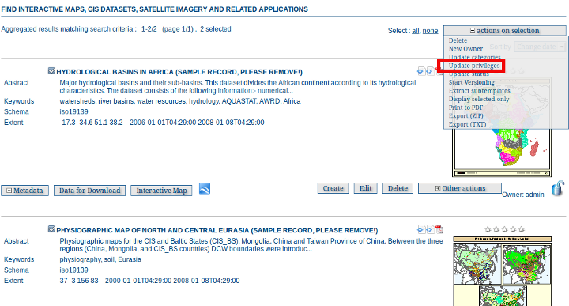
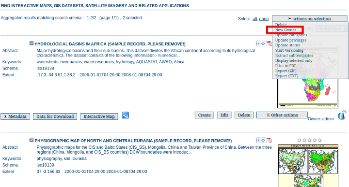

# Ownership and Privileges {#ownership}

Please review and make sure that you understand [User Profiles](../../admin/usersandgroups/index.md#user_profiles) in the User and Group Administration section of this manual.

!!! note

    A public metadata record is a metadata record that has the view privilege for the group named "All".

The following rules apply to Viewing and Editing permissions on a metadata record:

## Viewing

An *administrator* can view any metadata.

A *content reviewer* can view a metadata if:

1.  The metadata owner is member of one of the groups assigned to the reviewer.
2.  She/he is the metadata owner.

A *user administrator* or an *editor* can view:

1.  All metadata that has the view privilege selected for one of the groups she/he is member of.
2.  All metadata created by her/him.

A *registered user* can view:

1.  All metadata that has the view privilege selected for one of the groups she/he is member of.

Public metadata can be viewed by any user (logged in or not).

## Editing

An *administrator* can edit any metadata.

A *reviewer* can edit a metadata if:

1.  The metadata owner is member of one of the groups assigned to the reviewer.
2.  She/he is the metadata owner.

A *User Administrator* or an *Editor* can only edit metadata she/he created.

## Setting Privileges on a metadata record

A button to access the Privileges page for a metadata record will appear in the search results or when the record is being viewed for:

1.  All Administrators
2.  All Reviewers that are member of one of the groups assigned to the metadata owner.
3.  The Owner of the metadata

Privileges for the All and Intranet groups can only be edited by Administrators and Reviewers.

## Setting Privileges on a selected set of metadata records

Privileges can be set on a selected set of records in the search results using the "actions on selected set" menu. The following screenshot shows how to access this function:

The following rules apply:

-   the groups that will appear in the Privileges page will be those that the user belongs to
-   the Privileges specified will only be applied to records that the user has ownership or administration rights on - any other records will be skipped.

## Transfer Ownership

When metadata ownership needs to be transferred from one user to another for all or specific metadata records, the *Transfer Ownership* option is available. It is located in the Administration page and once selected, leads to the following page.

<figure>

<figcaption><em>How to open the Transfer Ownership page</em></figcaption>
</figure>

Initially, the page shows only a dropdown for a Source editor (the current metadata owner). The dropdown is filled with all GeoNetwork Users that have the Editor role and own some metadata. Selecting an Editor will select all metadata that is managed by that Editor. An empty dropdown means that there are no Editors with metadata associated and hence no transfer is possible.

!!! note

    The drop down will be filled with all Editors visible to you. If you are not an Administrator, you will view only a subset of all Editors.

<figure>

<figcaption><em>The Transfer Ownership page</em></figcaption>
</figure>

Once a Source Editor has been selected, a set of rows is displayed. Each row refers to the group of the Editor for which there are privileges. The meaning of each column is the following:

1.  *Source group*: This is a group that has privileges in the metadata that belong to the source editor. Put in another way, if one of the editor's metadata has privileges for one group, that group is listed here.
2.  *Target group*: This is the destination group of the transferring process. All privileges relative to the source group are transferred to the target group. The target group drop down is filled with all groups visible to the logged user (typically an administrator or a user administrator). By default, the Source group is selected in the target dropdown. Privileges to groups All and Intranet are not transferable.
3.  *Target editor*: Once a Target group is selected, this drop down is filled with all editors that belong to that Target group.
4.  *Operation*: Currently only the Transfer operation is possible.

By selecting the *Transfer* operation, if the Source group is different than the Target group, the system performs the Transfer of Ownership, shows a brief summary and removes the current row because now there are no privileges to transfer anymore.

## Setting Ownership on a selected set of metadata records

Ownership can be set on a selected set of records in the search results using the "actions on selected set" menu. The following screenshot shows how to access this function:

The following rules apply:

-   Only *administrators* or *user administrators* can set ownership on a selected set of records
-   *administrators* can set ownership to any user
-   *user administrators* can set ownership to any user in the same group(s) as them
-   Ownership will only be transferred on those records that the ownership or administration rights on - any others will be skipped.
