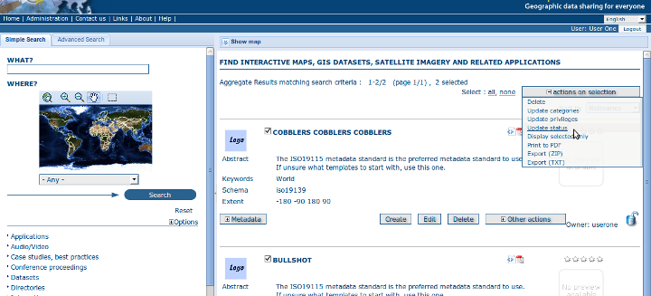
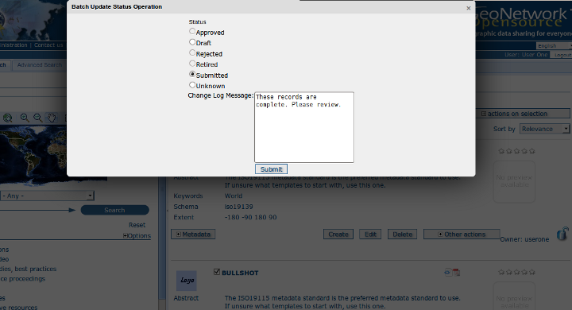

# Status {#metadata_status}

Metadata records have a lifecycle that typically goes through one or more states. For example, when a record is created and edited by an 'Editor' user it is in the 'Draft' state. Whilst it is reviewed by a 'Content Reviewer' user it would typically be in a 'Submitted' state. If the record is found to be complete and correct by the 'Content Reviewer' it would be in the 'Approved' state and may be made available for casual search and harvest by assigning privileges to the GeoNetwork 'All' group. Eventually, the record may be superseded or replaced and the state would be 'Retired'.

GeoNetwork has (an extensible) set of states that a metadata record can have:

-   **Unknown** - this is the default state - nothing is known about the status of the metadata record
-   **Draft** - the record is under construction or being edited.
-   **Submitted** - the record has been submitted for approval to a content review.
-   **Approved** - the content reviewer has reviewed and approved the metadata record
-   **Rejected** - the content reviewer has reviewed and rejected the metadata record
-   **Retired** - the record has been retired

Status can be assigned to metadata records individually or as a selected set.


*Initiating status change for a single metadata record*



*Initiating status change for a set of metadata records*

The interface for setting the status looks like the following:



*Changing the status of a set of metadata records*

It is also possible to search for metadata records with a particular status using a search restriction in the 'Advanced Search' menu.

## Status actions

The status values shown above are held in a database table called MetadataStatus. Extra states can be added to this table if required.

There are two status change action hooks (in Java) that can be used by sites to provide specific behaviours:

1.  *statusChange* - This action is called when status is changed by a user eg. when 'Draft' records are set to 'Submitted' and could be used for example to send notifications to other users affected by this change.
2.  *onEdit* - This action is called when a record is edited and saved and could be used for example to reset records with an 'Approved' status to 'Draft' status. A default set of actions is provided. These can be customised or replaced by sites that wish to provide different or more extensive behaviour.

A default pair of metadata status change actions defined in Java is provided wit GeoNetwork - see the class `org.fao.geonet.services.metadata.DefaultStatusActions.java`.

**statusChange**: This action is called when status is changed by a user. What happens depends on the status change taking place:

-   when an 'Editor' changes the state on a metadata record(s) from 'Draft' or 'Unknown' to 'Submitted', the Content Reviewers from the groupOwner of the record are informed of the status change via email which looks like the following. They can log in and click on the link supplied in the email to access the submitted records. Here is an example email sent by this action:
>
> ```{=html}
> <!-- -->
> ```
>     Date: Tue, 13 Dec 2011 12:58:58 +1100 (EST)
>     From: Metadata Workflow <feedback@localgeonetwork.org.au>
>     Subject: Metadata records SUBMITTED by userone@localgeonetwork.org.au (User One) on 2011-12-13T12:58:58
>     To: "reviewer@localgeonetwork.org.au" <Reviewer@localgeonetwork.org.au>
>     Reply-to: User One <userone@localgeonetwork.org.au.au>
>     Message-id: <1968852534.01323741538713.JavaMail.geonetwork@localgeonetwork.org.au>
>
>     These records are complete. Please review.
>
>     Records are available from the following URL:
>     http://localgeonetwork.org.au/geonetwork/srv/en/main.search?_status=4&_statusChangeDate=2011-12-13T12:58:58
>
-   when a 'Content Reviewer' changes the state on a metadata record(s) from 'Submitted' to 'Accepted' or 'Rejected', the owner of the metadata record is informed of the status change via email. The email received by the metadata record owner looks like the following. Again, the user can log in and use the link supplied in the email to access the approved/rejected records. Here is an example email sent by this action:
>
> ```{=html}
> <!-- -->
> ```
>     Date: Wed, 14 Dec 2011 12:28:01 +1100 (EST)
>     From: Metadata Workflow <feedback@localgeonetwork.org.au>
>     Subject: Metadata records APPROVED by reviewer@localgeonetwork.org.au (Reviewer) on 2011-12-14T12:28:00
>     To: "User One" <userone@localgeonetwork.org.au>
>     Message-ID: <1064170697.31323826081004.JavaMail.geonetwork@localgeonetwork.org.au>
>     Reply-To: Reviewer <reviewer@localgeonetwork.org.au>
>
>     Records approved - please resubmit for approval when online resources attached
>
>     Records are available from the following URL:
>     http://localgeonetwork.org.au/geonetwork/srv/en/main.search?_status=2&_statusChangeDate=2011-12-14T12:28:00

**onEdit**: This action is called when a record is edited and saved by a user. If the user did not indicate that the edit changes were a 'Minor edit' and the current status of the record is 'Approved', then the default action is to set the status to 'Draft' and remove the privileges for the GeoNetwork group 'All'.

## Changing the status actions

These actions can be replaced with different behaviours by:

1.  writing Java code in the form of a new class that implements the interface defined in org.fao.geonet.services.metadata.!StatusActions.java and placing a compiled version of the class in the GeoNetwork class path
2.  defining the name of the new class in the statusActionsClass configuration parameter in `INSTALL_DIR/web/geonetwork/WEB-INF/config.xml`
