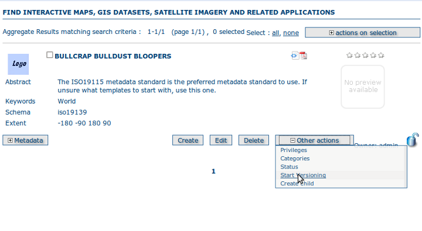
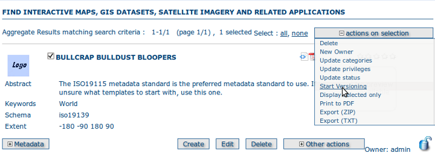
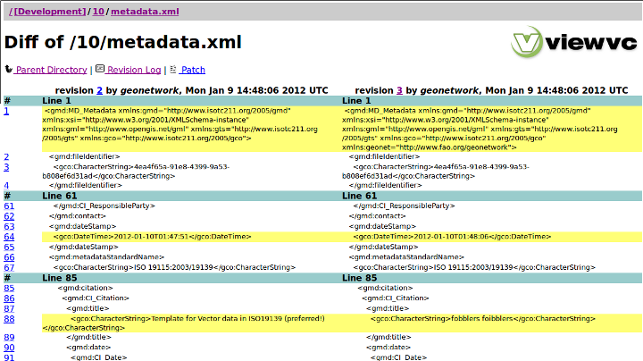
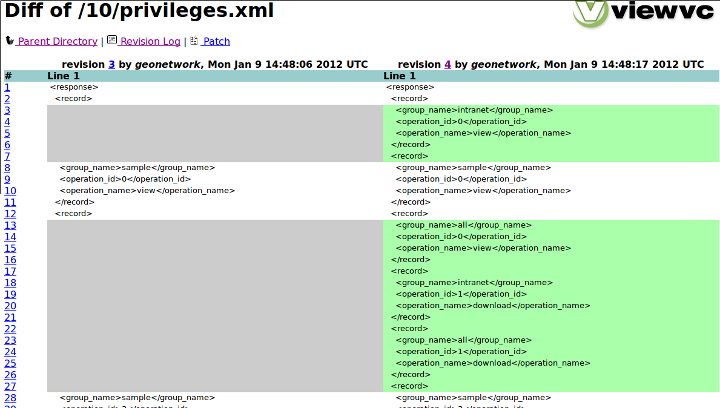

# Versioning {#metadata_versioning}

There are many use cases where it is important to be able to track (over time):

-   changes to the metadata record
-   changes to properties of the metadata record eg. privileges, categories, status

GeoNetwork uses a subversion repository to capture these changes and allow the user to examine the changes through the various visual interfaces to subversion repositories that already exist eg. viewvc. Apart from the advantage of ready to use tools for examining the changes, the subversion approach is efficient for XML files and simple to maintain.

The database remains the point of truth for GeoNetwork. That is, changes will be tracked in subversion, but all services will continue to extract the latest version of the metadata record from the database.

## Selecting records to version

Not all records in GeoNetwork are tracked as the compute and systems admin cost of this tracking for every record, particularly in large catalogs, is too high. Instead only those records selected by the user in the local GeoNetwork instance will be tracked in the subversion repository.

Records can be selected for versioning individually or by doing a search and selecting a set of records.

*Starting versioning on a single record*

*Starting versioning on a selected set of records*

## When will a new version be created?

Metadata records that are processed by a GeoNetwork service are associated with a database session. When the database session is committed, the metadata XML and its properties (as XML) are selected from the database and passed as a commit to the subversion repository, creating a new version in the repository. This process is automatic - at the moment the user cannot force a new version to be created, unless they change the metadata record or its properties.

Due to recent changes in the way in which GeoNetwork database sessions are committed (forced by the adoption of background threads for work tasks) and the implementation dependent way in which database transaction isolation is handled by different vendors, there is a small chance that database sessions may overlap. This may mean that the ordering of the changes committed to the subversion repository may not be correct in a small number of cases. After some discussion amongst the developers, the implementation may change to remove this possibility in the next version of GeoNetwork.

## How the changes are held in the subversion repository

The metadata record and its properties are stored in the subversion repository as XML files. The structure of the XML files describing the properties of the metadata is that returned by SELECT statements on the relevant database tables. The typical structure of a directory for a metadata record in the repository consists of a directory (named after the id of the metadata record) which contains:

-   metadata.xml - the XML metadata record
-   owner.xml - an XML file describing the owner of the metadata record
-   privileges.xml - an XML file describing the privileges of the metadata record
-   categories.xml - an XML file describing the categories to which the metadata record has been assigned
-   status.xml - an XML file describing the status of the metadata (eg. Approved, Rejected, etc)

A typical example of a privileges.xml file stored in the repository

    <response>
     <record>
       <group_name>intranet</group_name>
       <operation_id>0</operation_id>
       <operation_name>view</operation_name>
     </record>
     <record>
       <group_name>sample</group_name>
       <operation_id>0</operation_id>
       <operation_name>view</operation_name>
     </record>
     <record>
       <group_name>all</group_name>
       <operation_id>0</operation_id>
       <operation_name>view</operation_name>
     </record>
     <record>
       <group_name>intranet</group_name>
       <operation_id>1</operation_id>
       <operation_name>download</operation_name>
     </record>
     <record>
       <group_name>all</group_name>
       <operation_id>1</operation_id>
       <operation_name>download</operation_name>
     </record>
     <record>
       <group_name>sample</group_name>
       <operation_id>3</operation_id>
       <operation_name>notify</operation_name>
     </record>
     <record>
       <group_name>intranet</group_name>
       <operation_id>5</operation_id>
       <operation_name>dynamic</operation_name>
     </record>
     <record>
       <group_name>all</group_name>
       <operation_id>5</operation_id>
       <operation_name>dynamic</operation_name>
     </record>
     <record>
       <group_name>intranet</group_name>
       <operation_id>6</operation_id>
       <operation_name>featured</operation_name>
     </record>
     <record>
       <group_name>all</group_name>
       <operation_id>6</operation_id>
       <operation_name>featured</operation_name>
     </record>
    </response>

Difference between revisions 3 and 4 for the privileges.xml file for metadata record 10:

    svn diff -r 3:4
    Index: 10/privileges.xml
    ===================================================================
    --- 10/privileges.xml   (revision 3)
    +++ 10/privileges.xml   (revision 4)
    @@ -1,12 +1,52 @@
     <response>
       <record>
    +    <group_name>intranet</group_name>
    +    <operation_id>0</operation_id>
    +    <operation_name>view</operation_name>
    +  </record>
    +  <record>
         <group_name>sample</group_name>
         <operation_id>0</operation_id>
         <operation_name>view</operation_name>
       </record>
       <record>
    +    <group_name>all</group_name>
    +    <operation_id>0</operation_id>
    +    <operation_name>view</operation_name>
    +  </record>
    +  <record>
    +    <group_name>intranet</group_name>
    +    <operation_id>1</operation_id>
    +    <operation_name>download</operation_name>
    +  </record>
    +  <record>
    +    <group_name>all</group_name>
    +    <operation_id>1</operation_id>
    +    <operation_name>download</operation_name>
    +  </record>
    +  <record>
         <group_name>sample</group_name>
         <operation_id>3</operation_id>
         <operation_name>notify</operation_name>
       </record>
    +  <record>
    +    <group_name>intranet</group_name>
    +    <operation_id>5</operation_id>
    +    <operation_name>dynamic</operation_name>
    +  </record>
    +  <record>
    +    <group_name>all</group_name>
    +    <operation_id>5</operation_id>
    +    <operation_name>dynamic</operation_name>
    +  </record>
    +  <record>
    +    <group_name>intranet</group_name>
    +    <operation_id>6</operation_id>
    +    <operation_name>featured</operation_name>
    +  </record>
    +  <record>
    +    <group_name>all</group_name>
    +    <operation_id>6</operation_id>
    +    <operation_name>featured</operation_name>
    +  </record>
     </response>

Examination of this diff file shows that privileges for the 'All' and 'Intranet' groups have been added between revision 3 and 4 - in short, the record has been published.

Here is an example of a change that has been made to a metadata record:

    svn diff -r 2:3
    Index: 10/metadata.xml
    ===================================================================
    --- 10/metadata.xml     (revision 2)
    +++ 10/metadata.xml     (revision 3)
    @@ -61,7 +61,7 @@
         </gmd:CI_ResponsibleParty>
       </gmd:contact>
       <gmd:dateStamp>
    -    <gco:DateTime>2012-01-10T01:47:51</gco:DateTime>
    +    <gco:DateTime>2012-01-10T01:48:06</gco:DateTime>
       </gmd:dateStamp>
       <gmd:metadataStandardName>
         <gco:CharacterString>ISO 19115:2003/19139</gco:CharacterString>
    @@ -85,7 +85,7 @@
           <gmd:citation>
             <gmd:CI_Citation>
               <gmd:title>
    -            <gco:CharacterString>Template for Vector data in ISO19139 (preferr
    ed!)</gco:CharacterString>
    +            <gco:CharacterString>fobblers foibblers</gco:CharacterString>
               </gmd:title>
               <gmd:date>
                 <gmd:CI_Date>

This example shows that the editor has made a change to the title and the dateStamp.

## Looking at the revision history using viewvc - a graphical user interface

The viewvc subversion repository tool has a graphical interface that allows side-by-side comparison of changes/differences between files:

*Looking at the changes in a metadata record using browser to query viewvc*

*Looking at the changes in the privileges set on a metadata record using browser to query viewvc*

## XLink support

Metadata fragments (from directories local to GeoNetwork or from external URLs on the internet) can be linked into metadata records to support reuse. A record is said to be resolved when all available fragments have been copied into the record. With regard to XLinks the current implementation:

-   supports versioning of resolved records only
-   cannot version fragments of metadata held by GeoNetwork
-   will not create a new version of a metadata record when a change is made to one of its component fragments. Instead these changes will be picked up next time the record or its properties are changed.

Support for these corner cases may be added in future versions of GeoNetwork.
