# Link metadata and other resources {#metadata_link}

The following related resources are managed:

-   A thumbnail (linked using a URL or a file to upload)
-   A parent metadata record (UUID to the metadata)
-   A service metadata record
-   A dataset metadata record
-   A source dataset
-   An online resource
-   A feature catalog
-   A sibling

There is 2 ways of creating link between resources:

-   using the relation manager
-   or the metadata editor

The relation manager is only available for ISO19139 records (or ISO19139 profiles) but when related resources are metadata records, those records could be in any of the catalog supported standards (eg. ISO19110 for feature catalog, dublin core).

The relation manager provides a list of related resources and links to remove them.

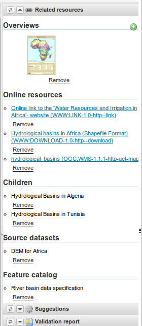

New relation could be added using the top right menu:

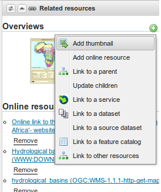

## Add a thumbnail

Two types of thumbnails could be linked to a metadata record:

-   an image linked using its URL (the image needs to be published online)
-   an image uploaded in the record data directory. During upload a small thumbnail could be created if requested.

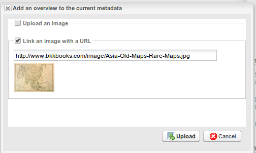

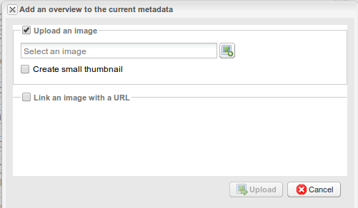

The relation panel allows to quickly remove a thumbnail.

When the image is uploaded, the XML snippet corresponding to the image is the following:

``` xml
<!-- Thumbnail added by  upload -->
<gmd:graphicOverview>
    <gmd:MD_BrowseGraphic>
        <gmd:fileName>
            <gco:CharacterString>http://localhost:8080/geonetwork/srv/eng/resources.get?uuid=7e512c38-f916-43ba-8367-85f17dcadca1&amp;fname=thumbnail.jpg</gco:CharacterString>
        </gmd:fileName>
        <gmd:fileDescription>
            <gco:CharacterString>large_thumbnail</gco:CharacterString>
        </gmd:fileDescription>
        <gmd:fileType>
            <gco:CharacterString>jpg</gco:CharacterString>
        </gmd:fileType>
    </gmd:MD_BrowseGraphic>
</gmd:graphicOverview>
```

When linking using a URL, the following XML snippet is inserted

``` xml
<!-- Thumbnail added by URL -->
<gmd:graphicOverview>
    <gmd:MD_BrowseGraphic>
        <gmd:fileName>
            <gco:CharacterString>http://organization.org/images/thumbnail.jpg</gco:CharacterString>
        </gmd:fileName>
    </gmd:MD_BrowseGraphic>
</gmd:graphicOverview>
```

In both cases, the information could be improved or updated using the editor from the advanced view > identification section.

## Add an online source

The relation manager allows to add an online resource element defining the following information:

-   URL or a file to upload
-   name
-   description
-   protocol

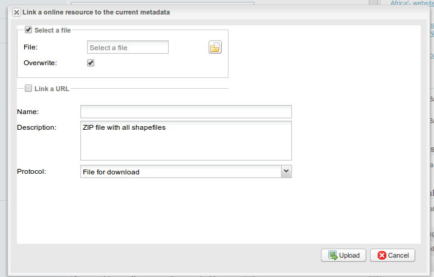

This information could be improved or updated using the editor from the advanced view > Distribution section.

### Linking WMS online resources

Metadata records in ISO19139 could be related to resources defined in WMS services. When searching metadata that has related WMS online resources, the *Interactive Map* button is displayed to load the WMS layer/s in the map viewer. A WMS online resource can be referenced in metadata like:

-   Selecting protocol **OCG-WMS Web Map Capabilities 1.1.1** or **OCG-WMS Web Map Capabilities 1.3.0**:

1.  *URL*: Url of WMS service
2.  Name of the resource: empty.

<figure>

<figcaption><em>WMS online resource</em></figcaption>
</figure>

The *Interactive Map* button opens a window to select the layer/s defined in WMS capabilities document to load in map viewer.

<figure>

<figcaption><em>Window to select WMS layer/s referenced in online resource to load in map viewer</em></figcaption>
</figure>

-   Selecting protocols **OGC-WMS Web Map Service**, **OGC Web Map Service 1.1.1** or **OGC Web Map Service 1.3.0**:

1.  *URL*: Url of WMS service
2.  *Name of the resource*: WMS layer name (optional)

<figure>

<figcaption><em>WMS online resource</em></figcaption>
</figure>

The behaviour the *Interactive Map* button depends if user indicated the layer name in the field *Name of the resource* or not, to show the window to select the layer/s to load in map viewer or load the layer directly.

### Linking data for download

You can upload a dataset stored on your local computer and create a link between data and the metadata description. Files in whatever format can be uploaded: doc, PDF, images, vector layers, etc. For the latter the distribution in a compressed file is recommended. You can include the vector data, the legend, any documentation that can help the interpretation of the data, related reports, detailed descriptions of the data processing, base data used to create the dataset specified and/or other relevant information. Follow these guidelines for uploading datasets:

-   Make sure the total size of the compressed file is reasonable (eg. less than 100 MB). Should your data be bigger than 100MB, consider a different mechanism to serve this data, e.g. through an FTP or HTTP server and than link the resource through an online resource 'Web address (URL)'.
-   Create several smaller files when appropriate and upload them sequentially.
-   Add the size of the file at the end of the description field.

To Upload a Dataset, follow these steps:

1.  The URL field can be left empty when uploading a file. The system will automatically fill this field out;
2.  Select the correct protocol to be used. If you do not see the buttons to browse and upload when File for download is selected, save the metadata and return to the upload section. Both buttons should appear;
3.  Provide a short description of the data;
4.  Click the Browse button and navigate to the folder where the file to be released is stored. Consider if you want to upload multiple files as one unique zip file or as multiple separate downloads. It is a good idea to add additional documentation with the datasets that provide the user with information related to the data described. Reminder: by default, the size of a single file upload cannot exceed 100 Mbytes unless your system administrator has configured a larger limit in the GeoNetwork config.xml file;
5.  Click Upload and then Save the metadata record.

<figure>

<figcaption><em>An online resource</em></figcaption>
</figure>

### Linking WMS for data visualization

You can link a dataset published in an OGC WMS service using the online resource section.

1.  Edit the metadata record
2.  Move to the distribution tab
3.  The URL field contains the WMS service URL;
4.  Select the correct protocol to be used (ie. OGC Web Map Service ver 1.1.1);
5.  The name of the resource is the name of the layer in the service (as defined in the GetCapabilities document);
6.  The description is optional;
7.  Click save.

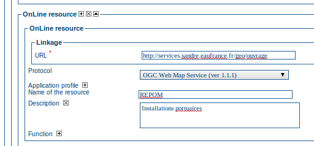

### Publish uploaded data as WMS, WFS {#GeoPublisher}

Integration of a map server allows users to quickly configure their data for interactive access without the need to go through the complexities of setting up and configuring a web map server. Web map server supported are:

-   GeoServer embedded with GeoNetwork
-   Remote GeoServer node (tested with 2.x or sup.)

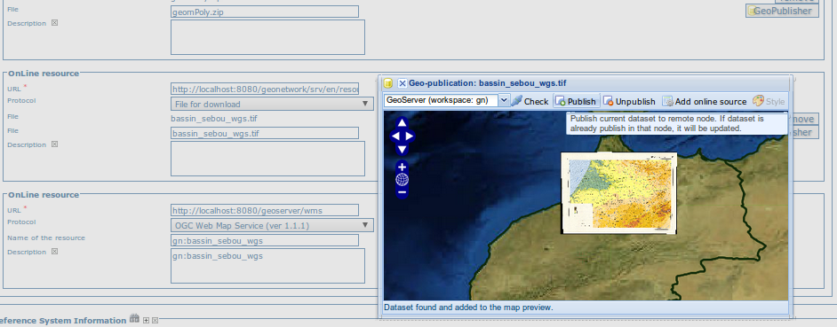

This mechanism allows users to publish the following GIS resources:

-   RASTER GeoTiff, ECW : ZIP or not or file path
-   ESRI Shapefile : ZIP or file path
-   Table PostGIS

In case of ZIP file, the resource must be uploaded to the metadata record.

#### Configuration

If after uploading data, you cannot see the geopublisher button, ask the catalogue administrator to check the configuration. This feature is disabled by default. It could be activated in the config-gui.xml configuration file.

If you cannot see your GeoServer node, ask the catalogue administrator to add the new node in geoserver-nodes.xml configuration file and check the config-gui.xml file:

    <!-- Display the geopublisher option for all updloaded files-->
    <editor-geopublisher/>

In order to add a new node, define the configuration in geoserver-nodes.xml:

    <!-- 
       Add here all geoserver node which could
       be configure by GeoNetwork.

       GeoServer 2.x or later are supported. The REST API must be installed in the GeoServer node.
       If you want to be able to publish in different workspaces, create as many nodes as 
       workspaces.

       @param name         Name of the GeoServer node, display to metadata editor
       @param namespace    Namespace to use. If not set, GeoServer will link store to another namespace.
       @param adminUrl     GeoServer REST service config URL
       @param wmsUrl       GeoServer WMS service URL use to display map preview
       @param wfsUrl       (Not used) GeoServer WFS service URL use to display map preview
       @param stylerUrl    (Optional) GeoServer WFS service URL use to display map preview
       @param user         GeoServer user login
       @param password     GeoServer user password 
    -->
    <node>
       <id>geoserverEmbedded</id>
       <name>GeoServer (workspace: gn)</name>
       <namespacePrefix>gn</namespacePrefix>
       <namespaceUrl>http://geonetwork-opensource.org</namespaceUrl>
       <adminUrl>http://localhost:8080/geoserver/rest</adminUrl>
       <wmsUrl>http://localhost:8080/geoserver/wms</wmsUrl>
       <wfsUrl>http://localhost:8080/geoserver/wfs</wfsUrl>
       <wcsUrl>http://localhost:8080/geoserver/wcs</wcsUrl>
       <stylerUrl>http://localhost:8080/geoserver/styler/index.html</stylerUrl>
       <user>admin</user>
       <password>geoserver</password>
    </node>

#### Link your data

In order to link a new dataset, do the following:

-   Open the record in edit mode
-   If you have a ZIP file or RASTER image, upload the data to the record from the advanced view > Distribution section or the relation manager.

| Fields   | Vector (ZIP Shapefile)                                                                                                                | RASTER (ZIP or not) |
|----------|---------------------------------------------------------------------------------------------------------------------------------------|---------------------|
| URL      | URL to the file uploaded in the catalog <http://localhost:8080/geonetwork/srv/en/resources.get?id=1631> &fname=CCM.zip&access=private | idem                |
| Protocol | File for download WWW:DOWNLOAD                                                                                                        | idem                |
| Name     | File name (readonly)                                                                                                                  | idem                |

-   For PostGIS table or file on local network :

| Fields   | Vector (ZIP Shapefile)                                                | RASTER (ZIP or not)                    |
|----------|-----------------------------------------------------------------------|----------------------------------------|
| URL      | DB connexion URL jdbc:postgresql://localhost:5432/login:<password@db> | Directory name <file:///home/geodata/> |
| Protocol | PostGIS Table DB:POSTGIS                                              | File RASTER <FILE:RASTER>              |
| Name     | Table name                                                            | File name                              |

#### Publish your data

The geopublication wizard is then available:

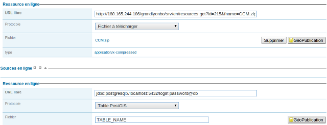

-   Select a not to publish into

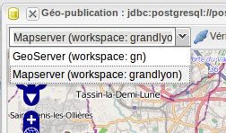

-   The catalog check that file is valid


-   Publish button: Publish current dataset to remote node. If dataset is already publish in that node, it will be updated.
-   Unpublish button: Remove current dataset from remote node.
-   Add online source button: Add an onlinesource section to the current metadata record pointing to the WMS and layername in order to display the layer in the map viewer of the search interface.
-   Style button: Only available if the GeoServer styler has been installed and declared in the configuration.

No layer names are asked to the user. Layer name is compute from the file name.

In case of ZIP compression, ZIP file base name must be equal to Shapefile or GeoTiff base name (ie. if the shapefile is rivers.shp, ZIP file name must be rivers.zip).

One Datastore, FeatureType, Layer and Style are created for a vector dataset (one to one relation). One CoverageStore, Coverage, Layer are created for a raster dataset (one to one relation).

#### Link the services to the metadata

The link to metadata button add information to the metadata record in order to be link the services to the metadata. This will be used to visualize the layer on the map viewer for example.

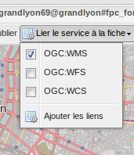

## Add a parent metadata record

In order to add a link to a parent metadata record, search for the target record and select the parent metadata to link to the current in editing.

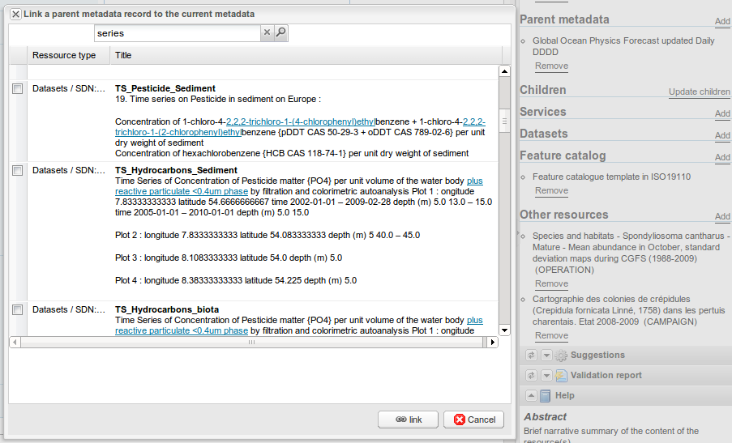

Once added, the following XML fragment is inserted in the metadata record:

``` xml
<gmd:parentIdentifier>
    <gco:CharacterString>SDN:PRODUCT:1850:Time Series Tributyltin (TBT) in Sediment</gco:CharacterString>
</gmd:parentIdentifier>
```

In the editor, the relation could be updated in the metadata section:


When a record has children records, the update children wizard could be executed:

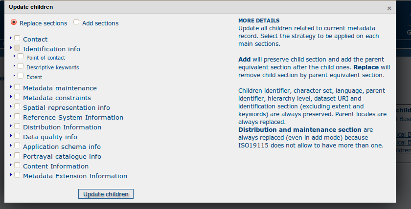

This information could be improved or updated using the editor from the advanced view > Metadata section.

## Add a sibling

ISO Metadata records can be related to another record with different type of relations. The elements in the ISO standard providing those links is the aggregationInfo element. Sibling relationships types can be specified using the initiative type and association type fields.

In order to add a sibling link:

-   choose a type of association
-   choose a type of initiative
-   and search for the records to link

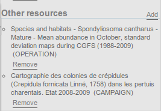

Multiple sibling could be linked to the record in one time defining for each element the association type and initiative type to use:

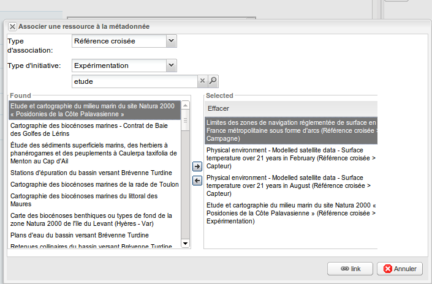

The type of sibling is displayed in the relation manager which allows to quickly remove the relation if needed:


Once added, the following XML is inserted in the metadata record:

``` xml
<gmd:aggregationInfo>
    <gmd:MD_AggregateInformation>
        <gmd:aggregateDataSetIdentifier>
            <gmd:MD_Identifier>
                <!-- optional gmd:authority here: could have details of a register describing the some details of the sibling record -->
                <!-- code is UUID/urn of the sibling record, could be a gmx:Anchor -->
                <gmd:code>
                    <gco:CharacterString>urn:marine.csiro.au:project:1532</gco:CharacterString>
                </gmd:code>
            </gmd:MD_Identifier>
        </gmd:aggregateDataSetIdentifier>
        <gmd:associationType>
            <gmd:DS_AssociationTypeCode codeList="http://...#DS_AssociationTypeCode" 
                                        codeListValue="crossReference">crossReference</gmd:DS_AssociationTypeCode>
        </gmd:associationType>
        <!-- initiative type describes the type of sibling relationship - in this case the code is a project 
             related to the record that contains this aggregateInformation -->
        <gmd:initiativeType>
            <gmd:DS_InitiativeTypeCode codeList="http://...#DS_InitiativeTypeCode" 
                                       codeListValue="project">project</gmd:DS_InitiativeTypeCode>
        </gmd:initiativeType>
    </gmd:MD_AggregateInformation>
</gmd:aggregationInfo>
```

This information could be improved or updated using the editor from the advanced view > Identification section.

## Add a source dataset

In the data quality section, the source dataset could be linked to a record.

Once added, the following XML fragment is inserted in the metadata record:

``` xml
<gmd:source uuidref="095cdc57-f44b-4613-894c-f09f1b672140">
</gmd:source>
```

In the editor, the relation could be updated in the data quality section:

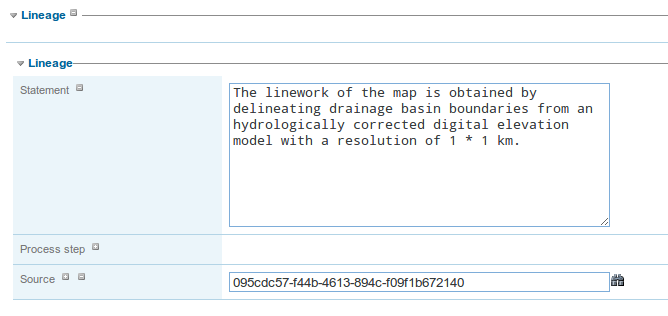

This information could be improved or updated using the editor from the advanced view > Data quality section.

## Add a feature catalog

The feature catalog is used to describe the data model of a dataset using the ISO19110 standards. In the content information section, the feature catalog could be linked to a record. The relation panel filter ISO19110 record in order to quickly link a feature catalog.

Once added, the following XML fragment is inserted in the metadata record:

``` xml
<gmd:contentInfo>
    <gmd:MD_FeatureCatalogueDescription>
        <gmd:includedWithDataset/>
        <gmd:featureCatalogueCitation uuidref="46ce9c2f-6c37-4ae7-9511-63940ece5760" xlink:href="http://localhost:8080/geonetwork/srv/en/csw?service=CSW&amp;request=GetRecordById&amp;version=2.0.2&amp;outputSchema=http://www.isotc211.org/2005/gmd&amp;elementSetName=full&amp;id=46ce9c2f-6c37-4ae7-9511-63940ece5760"/>
    </gmd:MD_FeatureCatalogueDescription>
</gmd:contentInfo>
```

In the editor, the relation could be updated in the content information section:

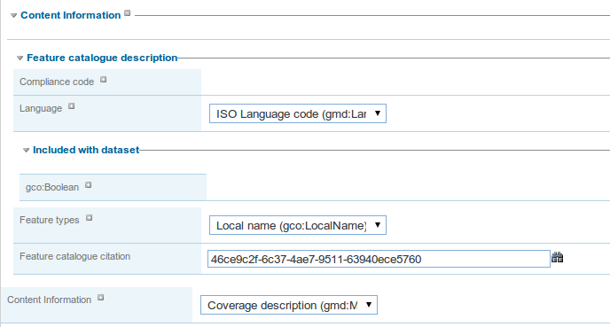

This information could be improved or updated using the editor from the advanced view > Content information section.

## Metadata on dataset / metadata on service relation

Linking a dataset to a service or a service to a dataset is made using the following panel:

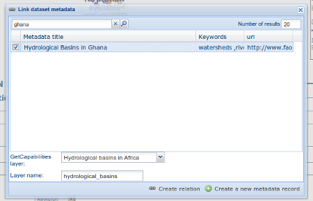

Editor could define a layer name using the combo box (which try to retrieve layers from the WMS GetCapabilities document) or typing the layer name in the text field. This information is required to display the layer using the map viewer.

Relation is stored in :

``` xml
<srv:operatesOn uuidref="" xlink:href=""/>
```

and (according to ISO CSW profil)

``` xml
<srv:coupledResource>
  <srv:SV_CoupledResource>
    <srv:operationName></srv:operationName>
    <srv:identifier></srv:identifier>
    <gco:ScopedName></gco:ScopedName>
  </srv:SV_CoupledResource>
</srv:coupledResource>
```

Only relation between records in the same catalogue are handle. Use of XLink attributes are not supported to create relation between datasets and services.

This information could be improved or updated using the editor from the advanced view > Identification section.
